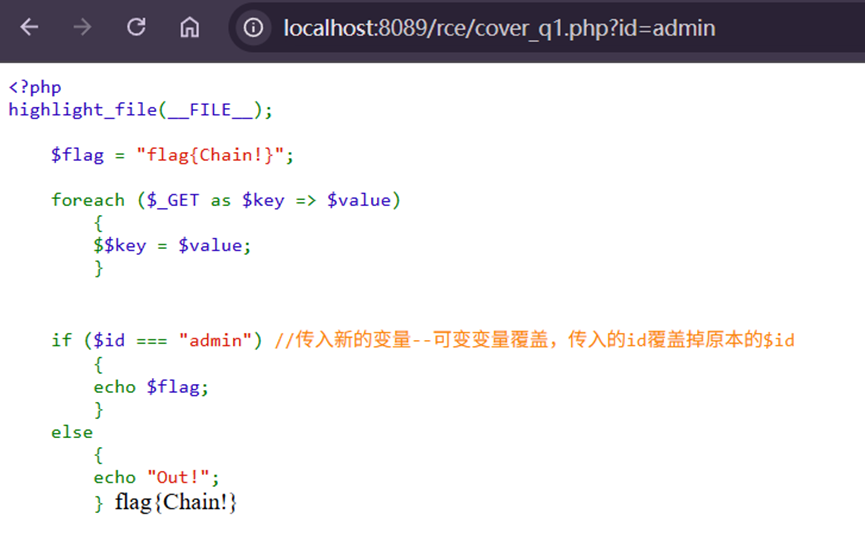
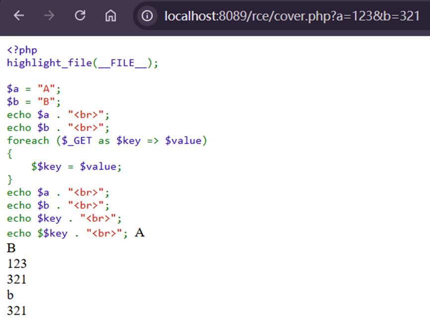

---
tags:
  - PHP
  - variable
date: 2026-01-02
---

如果传入一个参数 **?id=1**，并且这个参数把原有的变量值给覆盖掉了则叫做 **变量覆盖漏洞**

# 可变变量
将一个变量的值作为新的变量名称

此处本身没有id这个变量有接口传入
但是上方有一段代码意味着GET传入的值作为新变量的键值
而键名作为新的变量

通过foreach传入a和b的新的值，可以看到a和b的原来的值被覆盖了
**第一次循环（处理a=123）：**
`$key = "a"（当前遍历的键名），$value = "123"（当前遍历的键值）`
`- $$key = $value → 等价于$a = "123"（将$key的值 "a" 作为变量名，赋值为 "123"）`
`此时$a被覆盖，从原来的 "A" 变成 "123"。`
**第二次循环（处理b=321）：**
`$key = "b"（当前遍历的键名），$value = "321"（当前遍历的键值）`
`$$key = $value → 等价于$b = "321"（将$key的值 "b" 作为变量名，赋值为 "321"）`
`此时$b被覆盖，从原来的 "B" 变成 "321"。`
`再者，由于有可变变量$$的存在，最后一次记录也就是后来的b=321使得$key=b并且$$key现在是等价于$b所以$$key=321=$b`
