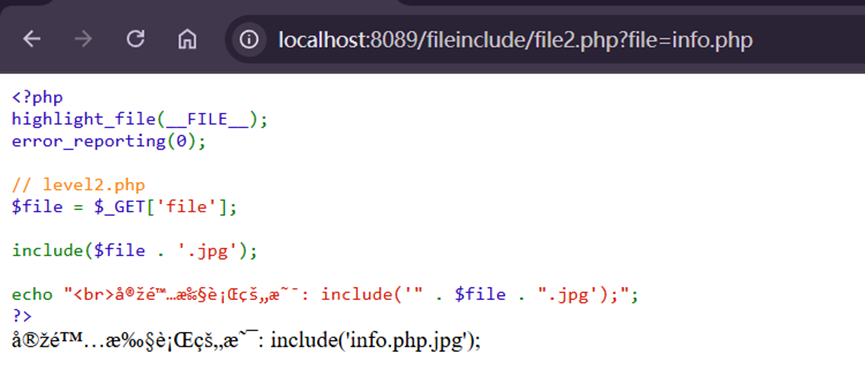
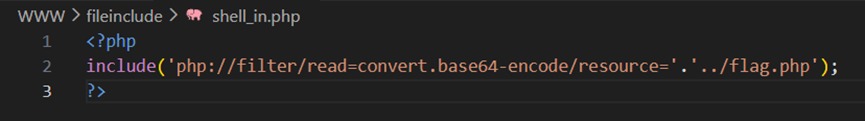
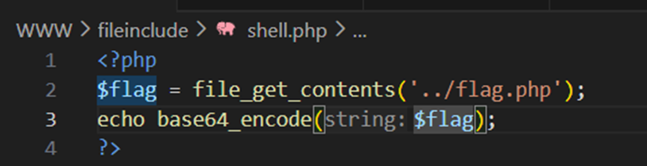

---
tags:
  - include
  - PHP
Date: 2026-01-02
---

## 有一些题目会使用jpg后缀

会导致包含的文件强行变成.jpg因此不能直接包含

# 方法一 使用zip协议绕过
## 前提是上传文件到对应目录
使用zip协议绕过，将shell放进zip里面执行
例如
```info.php 
<?php phpinfo();?>
```
将php文件打包成<mark style="background: #FFB8EBA6;">zip</mark>文件
==zip://D:\phpstudy_pro\WWW\fileinclude\info1.zip%23info==
格式为zip://文件路径/zip文件名称#压缩包内的文件名称 （使用时注意将#号进行URL编码--%23）

### 因此需要注意的是知道包含文件的路径

要包含上级文件../flag.php
用include嵌套php伪协议
#### 或者

使用file_get_contents()
也可以直接获取内容