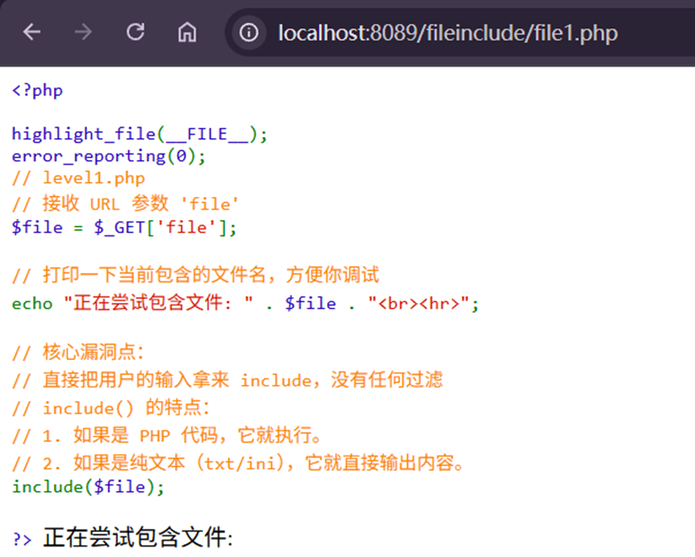
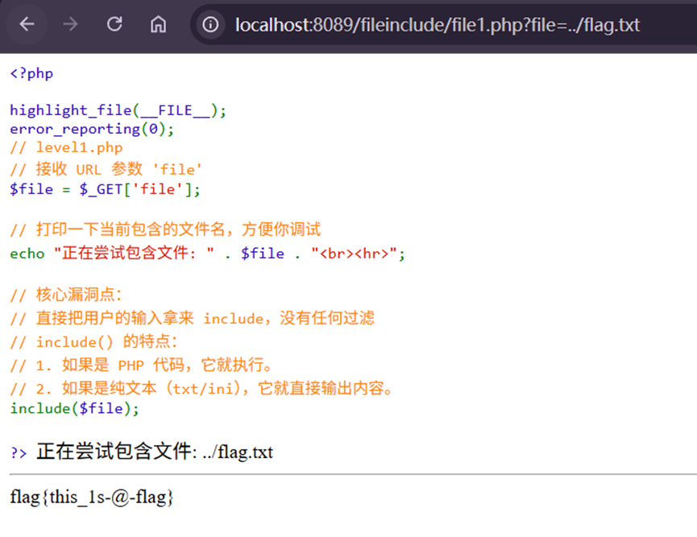

---
tags:
  - PHP
  - include
date: 2026-01-02
---

# 文件包含概述
什么是文件包含？

> 开发人员常常把可重复使用的函数写入到单个文件中，在使用该函数时，直接调用此文件，而无需再次编写函数，这一过程就叫做包含。

比如说 `Python` 中我们可以通过 `import` 导入其他 Python 文件中的代码，从而实现 Base 编解码的功能。

```python
import base64

s = b'Hello CTF'
print(base64.b64encode(s))
```

又比如 `C语言` 中的 `include` 将 `stdio.h` 文件中的代码包含到当前文件中，从而实现标准输入输出。

```C
#include <stdio.h>

int main() {
  printf("Hello CTF");
  return 0;
}
```

## 通常使用include()

## include()漏洞基础

直接将file变量输入需要包含的文件



### 如果遇到PHP文件，则会执行语句而不是直接打印内容
此时，可以使用base64编码输出从而绕过执行

### 使用php伪协议
php://filter/read=convert.base64-encode/resource=flag.php
filter过滤
read使用的过滤方式
resource筛选数据流

| 名称                 | 描述                                              |
| ------------------ | ----------------------------------------------- |
| resource=<要过滤的数据流> | 这个参数是必须的。它指定了你要筛选过滤的数据流。                        |
| read=<读链的筛选列表>     | 该参数可选。可以设定一个或多个过滤器名称，以管道符（`\|`）分隔。              |
| write=<写链的筛选列表>    | 该参数可选。可以设定一个或多个过滤器名称，以管道符（`\|`）分隔。              |
| <；两个链的筛选列表>        | 任何没有以 `read=` 或 `write=` 作前缀 的筛选器列表会视情况应用于读或写链。 |
