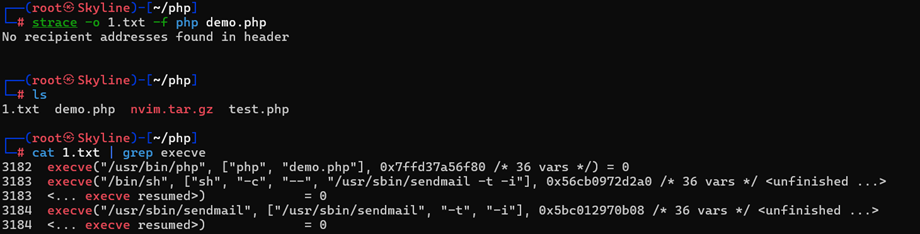
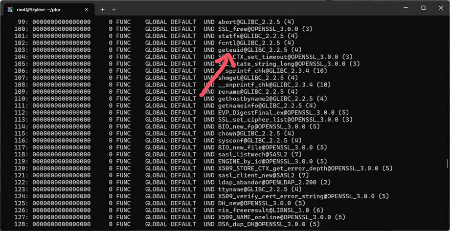
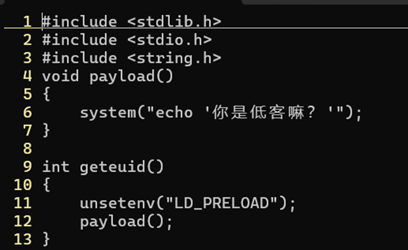
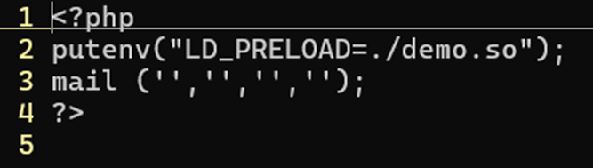
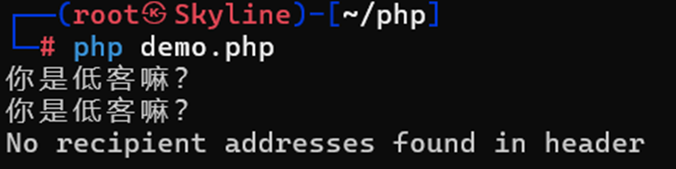
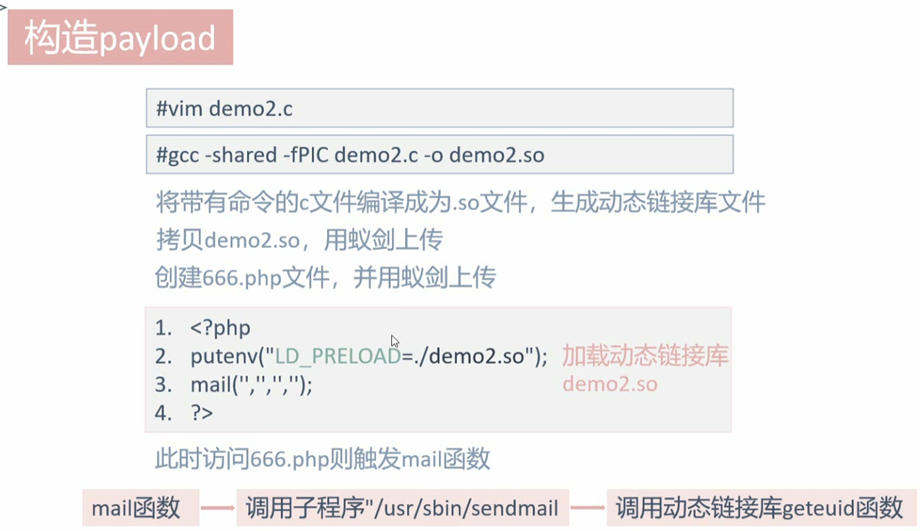
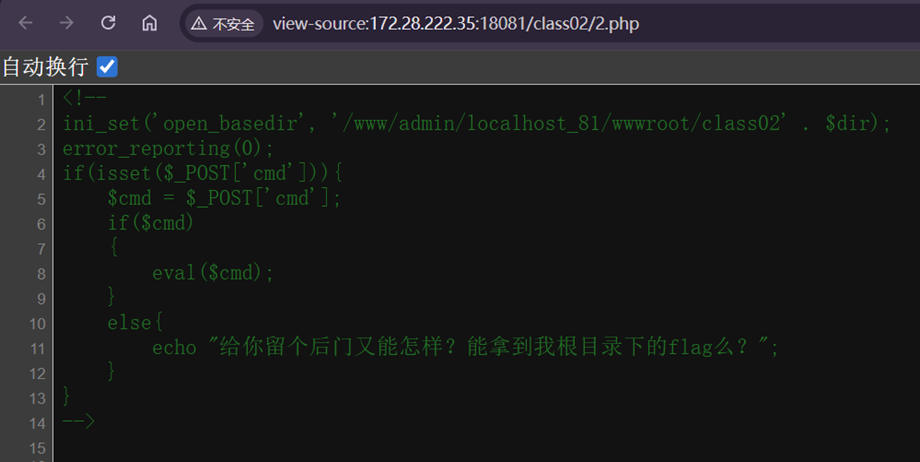
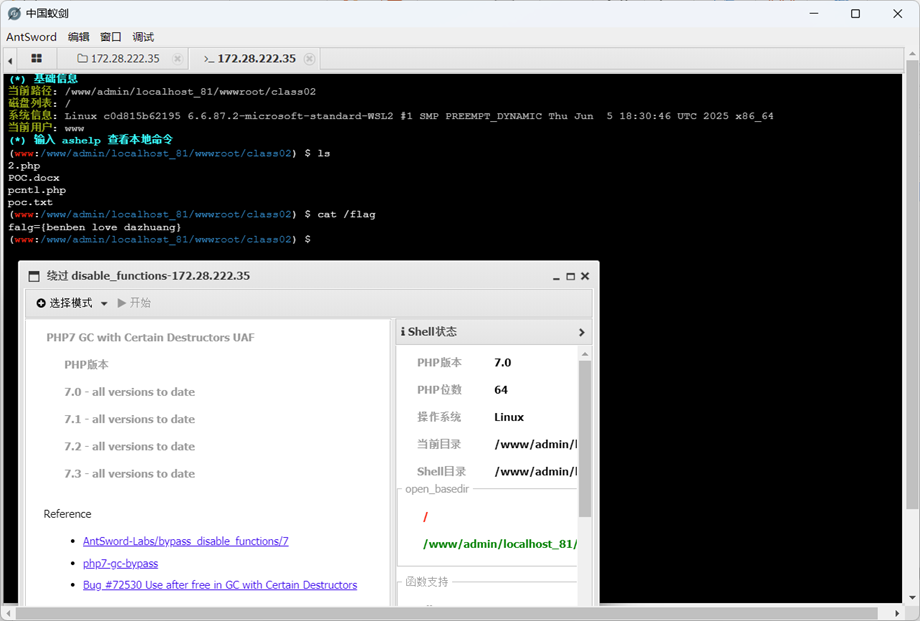

---
tags:
  - RCE
  - PHP
date: 2026-01-08
---
# LD_preload
LD_PRELOAD 是一个可选的 Unix 环境变量， 包含一个或多个共享库或共享库的路径

它允许你定义在程序运行前优先加载的动态链接库，即我们可以自己生成一个动态链接库加载，以覆盖正常的函数库，也可以注入恶意程序，执行恶意命令

## 手动操作：
如果在php中有调用mail函数的时候，可以查看到执行了哪些子程序

具有sendmail这一个方法的动作
如果当它被调用的时候，是否可以修改它的库文件经行操作呢？
使用 readelf -Ws usr/bin/sendmail进行查看

其中有调用一个geteuid的方法
获取uid判断身份，权限分析
原本mail将会直接调用，如果替换掉这个动作，是否可以修改掉原本的功能

生成一份c程序文件，定义geteuid准备顶替原来的版本
然后gcc编译

然后我们再次在执行demo.php调用mail函数之前加入我们自己制作的这个demo.so库文件

再次执行文件可以发现确实被成功调用了

## 过滤条件
1.能够上传.so文件，并且能够设置LD_PRELOAD的值（环境变量）

2.Putenv未被禁止等

3.存在可以控制PHP启动外部程序的函数并能执行（因为新进程启动将加载**LD_RELOAD**

中的.so文件),比如**mail()、imap_mail()、mb_send_mail()和error_log()**等。

## 自动化操作
例如如下：

一份例题：
[https://hello-ctf.com/hc-web/rce/#ld_preload](https://hello-ctf.com/hc-web/rce/#ld_preload)

在一道禁用函数的例题中，如果可以使用蚁剑连接，那么可以使用其插件进行绕过

可以直接选用多种方式绕过然后直接读取内容