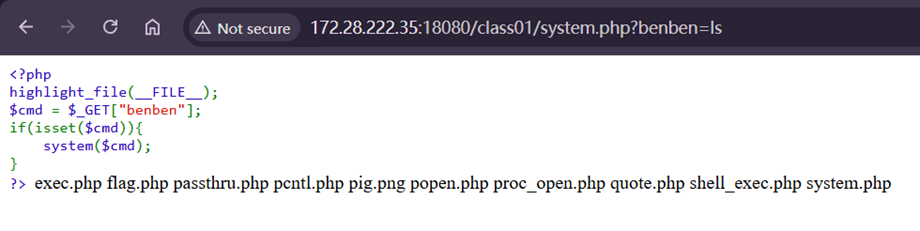
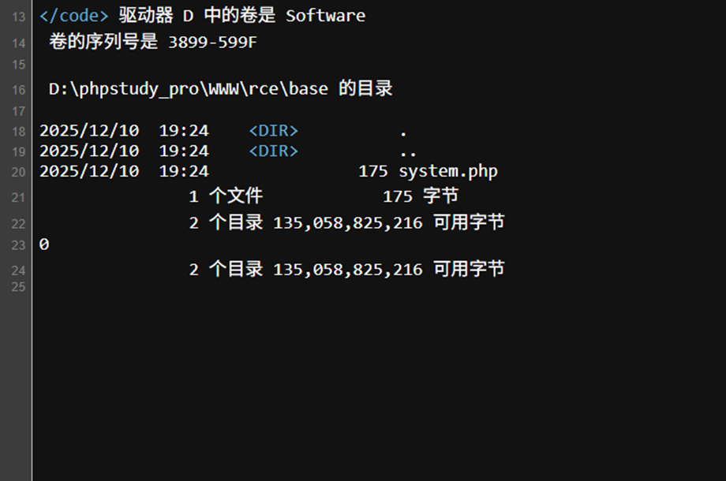
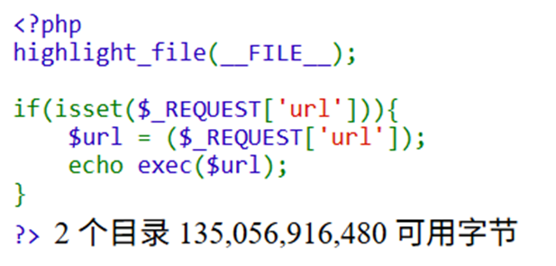
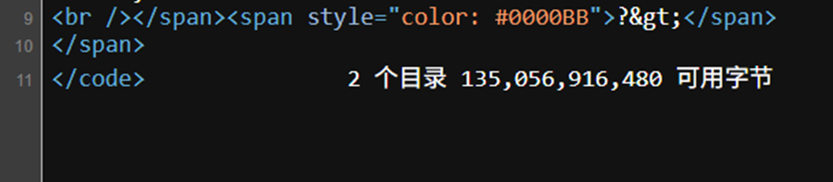
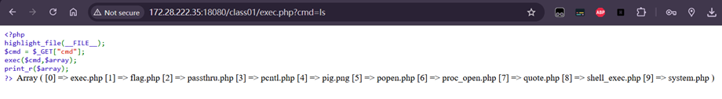
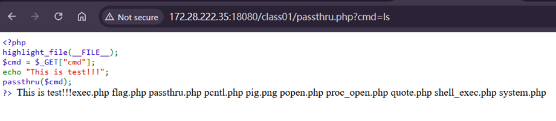
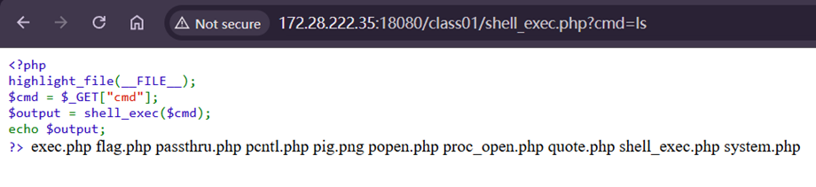
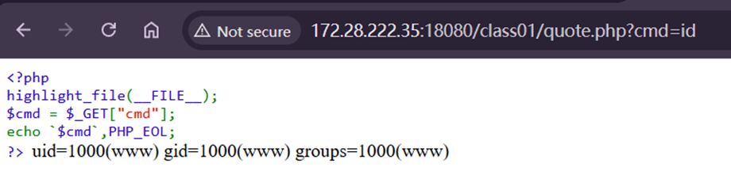

---
tags:
  - RCE
  - PHP
date: 2026-01-03
---
# 常见的函数
## php代码相关 
eval() assert() preg_replace call_user_func() call_user_func_array() create_function array_map()

## 系统命令执行相关
system() passthru() exec() pcntl_exec() shell_exec() popen() proc_open()  
`` `(反引号)`` ob_start()

# System()
```PHP
System(string $command, int $return_var=?) : string
```

<mark style="background: #FFB8EBA6;">Command</mark> 执行command参数的命令

如果提供return_var参数的话，外部命令执行后的返回状态设置到此变量

没有return变量的情况，可以直接在上述代码传入参数例如ls，查看当前目录文件



带有return参数的情况

在网页源代码查看

1. system() 是 “执行型函数”，它的核心逻辑就是「执行系统命令 + 输出命令结果 + 返回最后一行」，这个逻辑只要调用就会触发；
2. $b = system($url, $a) 这句话的完整执行步骤是：

- 第一步：调用 system($url, $a)，执行其核心逻辑（执行 dir 命令 → 打印 dir 全部输出 → 给 $a 赋值退出状态码 → 计算返回值（最后一行））；
- 第二步：把 system() 计算出的返回值（最后一行）赋值给变量 $b；



可以看到第一部分就是system(dir)打印出来的内容，0就是$a的结果，$b和dir的最后一行相同，也就是$b = system()的含义

同时，源代码的变量接上.PHP_EOF表示换行（自动根据操作系统识别）
例如传入无效的命令


就会返回1的错误值

# exec()
Exec(string $command, array $output=?, int $return_var=?)
这里执行command之后只有最后一行结果**并且不会回显**
Output，用命令执行的输出填充此数组



此时url=dir



可以看到只返回了最后的一行结果
当含有array参数的时候，就会从数组中回显出数据
可以用var_dump或者printr进行回显数组



# passthru()
Passthur(string $command, int $return_var=?)
输出二进制数据，直接传送到浏览器
类似与system()，用法一样，可以代替绕过



# exec_shell & \` 
Shell通`一样为操作执行符
没有回显，需要echo输出



反引号则是直接执行命令，等于system()



