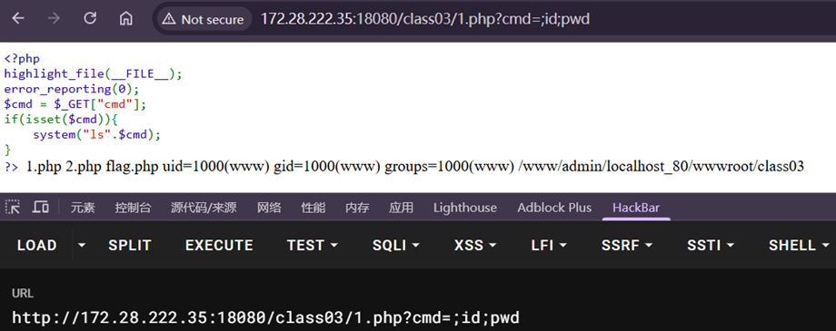
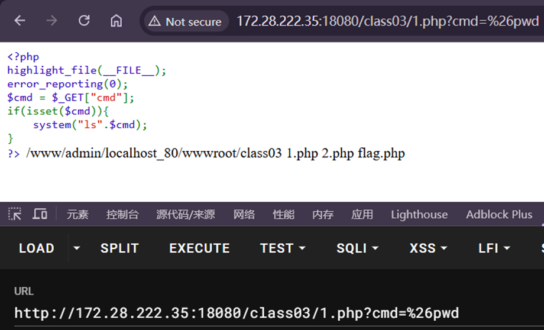
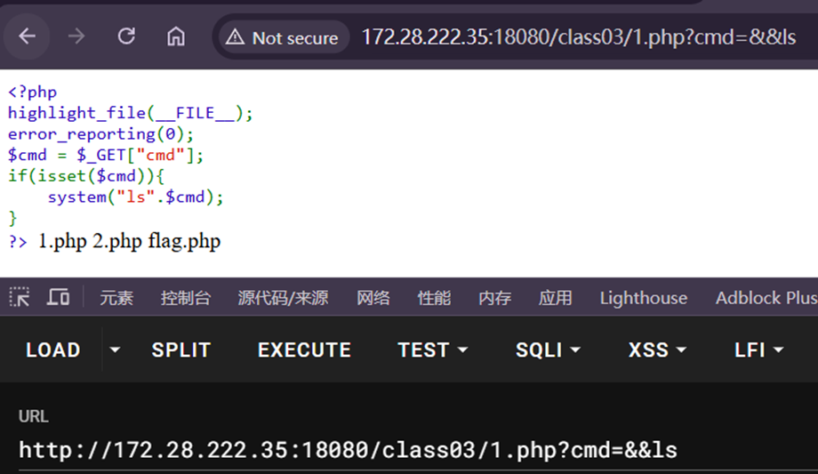
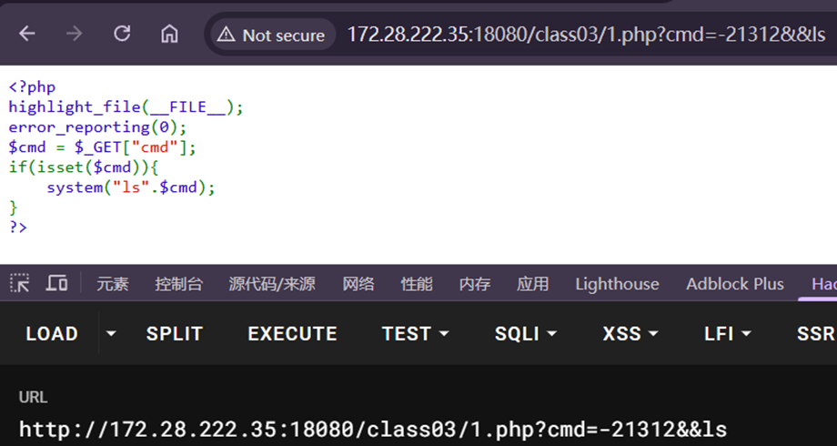
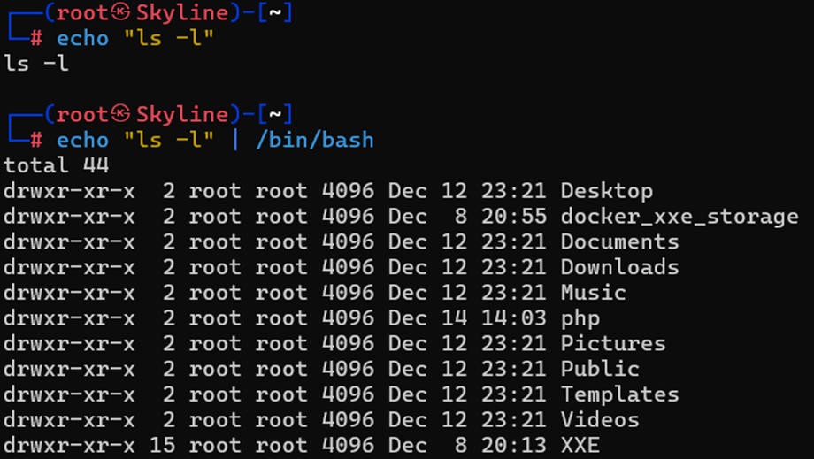
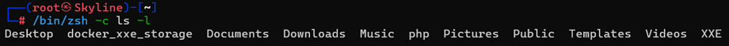
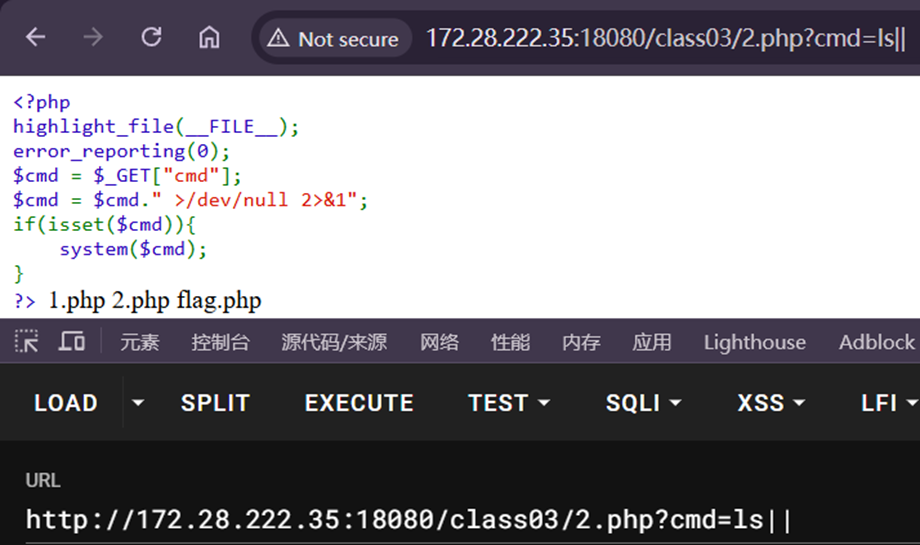

---
tags:
  - RCE
  - PHP
  - system
date: 2026-01-08
---
# 分号;
以分号隔开的命令会按照顺序依次执行

题目中的system()不仅执行了ls，还连接了$cmd的内容

如果直接写入命令(例如pwd)，则会被识别为system(ls.pwd)从而导致都没有执行

因此需要分开隔断，此时可以用到；

# and&
同时执行多个命令
和`;`类似，但是提交时需要使用url编码--%26

# 并&&
前后都为可执行的命令才会都执行，要么都执行要么都不执行

# 管道符|
将前面的命令作为后面命令输入

前面命令的结果当作后面命令参数

前后都会执行，但是只显示后面的结果

# 或||
类似if eles
前面的命令执行失败就执行后面的

在cmd键值的后面添加||，因此前面的命令被执行后，后面的/dev…过滤指令就被忽过滤了
通过||可以过滤命令

