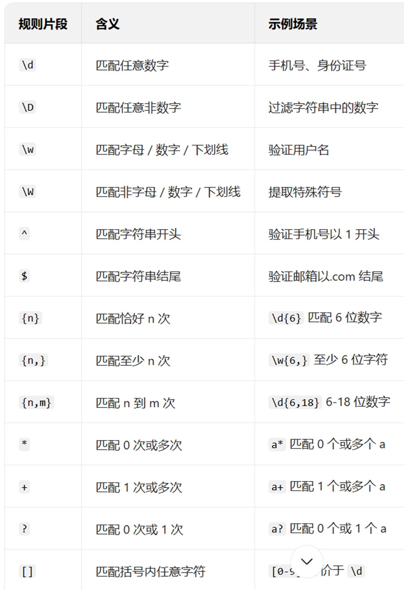
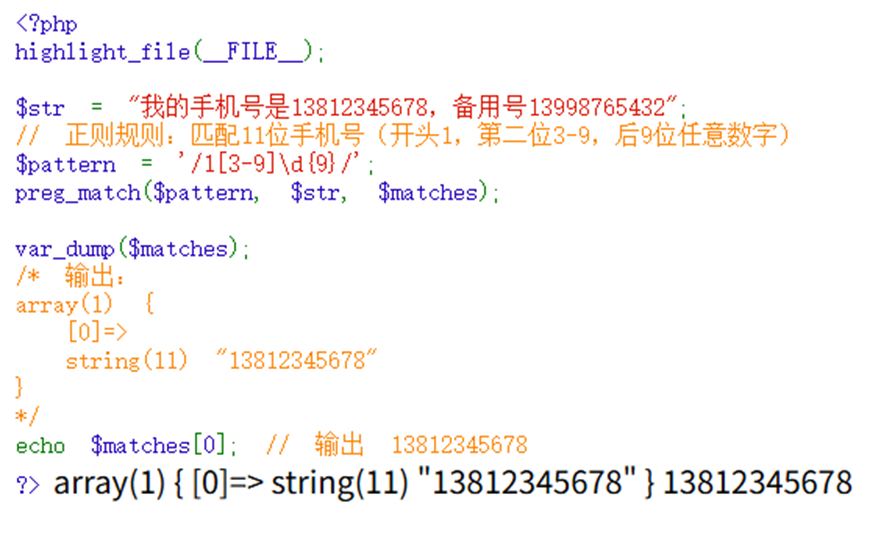
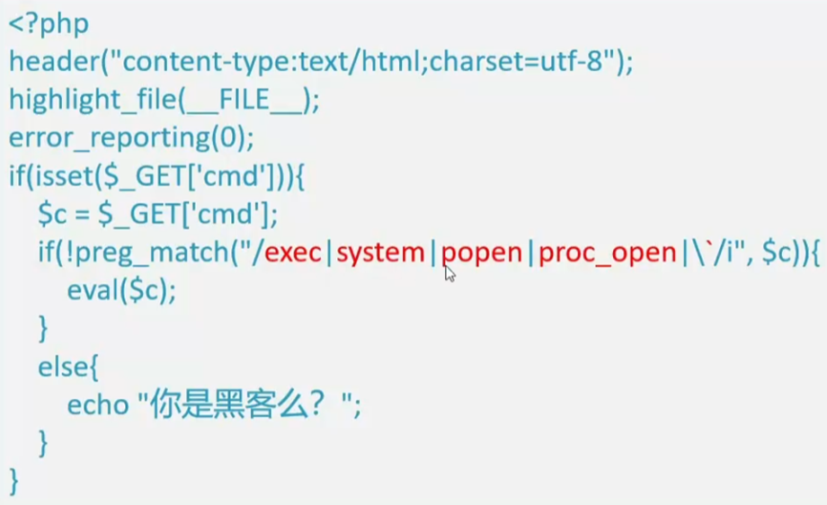
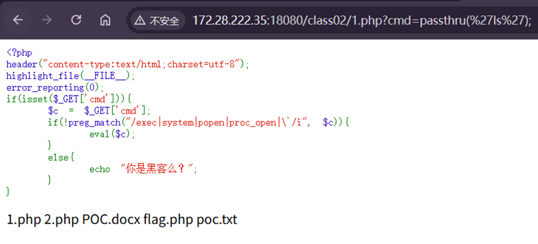
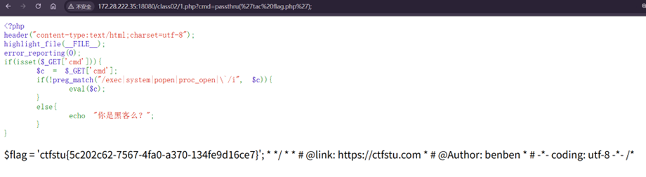

# preg_match()
例如：preg_match(“/exec|system|\`/i”) 使用/ /包裹内容

如下为常用规则:

例如以下:

利用正则表达式的话，结合if语句进行判断，通常用!preg()的形式过滤响应指令，例如exec等
**替换函数：**

如上述，当传入的cmd的键值含有exec system等字样的话，!取反就会返回0给if导致执行else语句，成功被过滤掉，因此需要绕过对应命令

我们可以使用和system类似作用的passthru进行绕过
注意`''`包含字符串和结尾的`;`

同理可以使用cat尝试获取文件并且在注释查看
这时，我们得知由于flag的信息被注释，这时候可以使用倒序输出tac
Tac与cat相反，则会将\<?php这个php文件开头放在最后读取

