---
tags:
  - PHP
  - RCE
Date: 2026-01-09
---
# tac反向读取
从文件的最后一行往前读取，如上述源代码可见

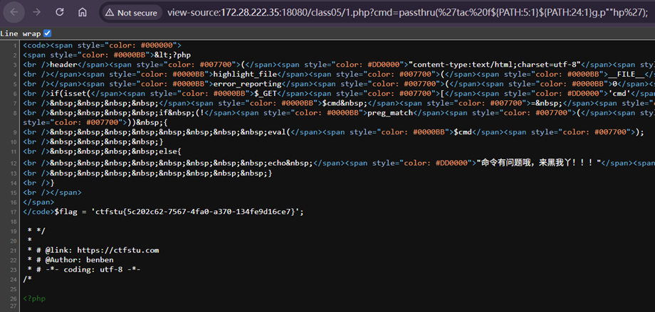

反向读取使得文件\<?php在最后，以此关键信息实际上没有被php语句包裹，从而直接显示在页面上而没有被注释

# more & less
具有分页查看内容的功能，解决了cat查看大文件内容刷屏的问题
MORE-基础版本

LESS-功能更加全面

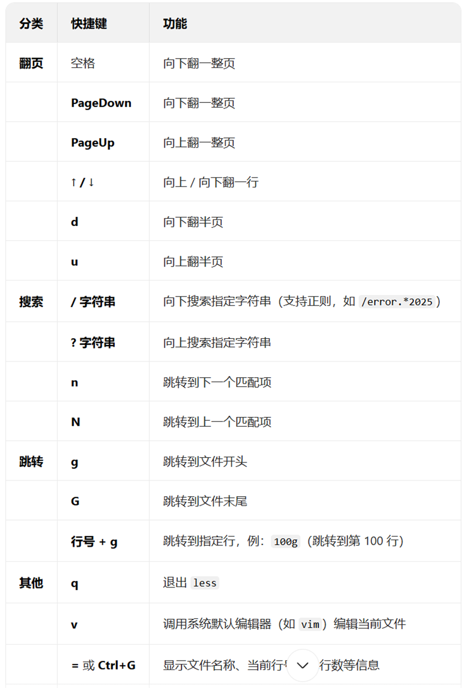

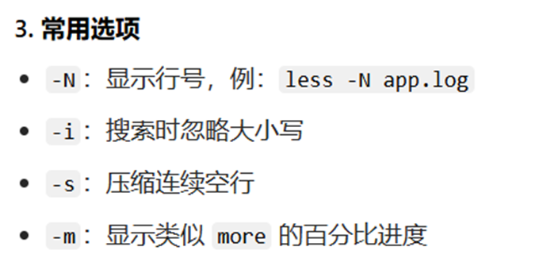

都可以**分页获取**内容

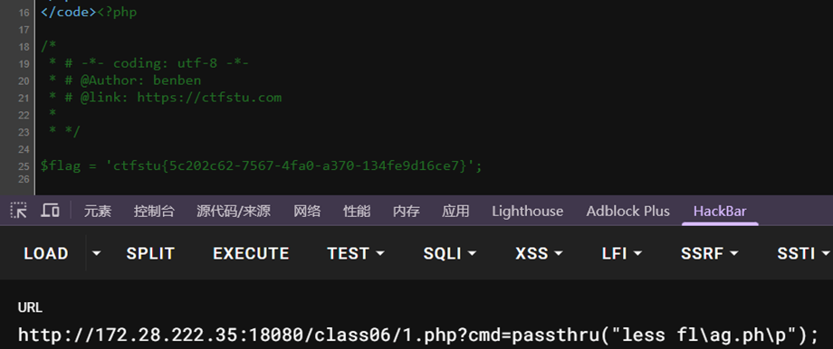

# tail
查看末尾几行，默认10行

# nl
和cat一样的作用，只是在每行前有行号显示

# od
Od 以八进制回显读取文件

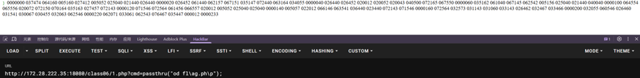

通过转换为可读十进制形式

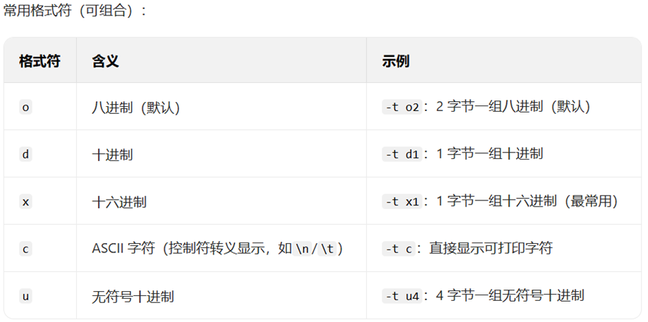

通常使用-A d -c的形式

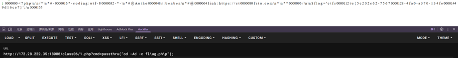

# xxd
没有od可用时候，可以尝试xxd，十六进制和二进制互相转换

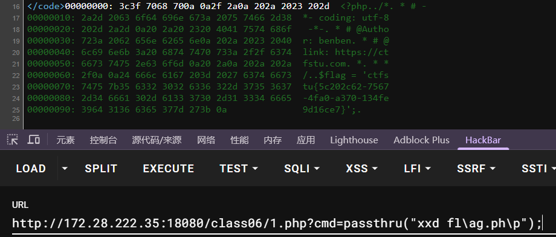

# sort
用以排序文件，同时可以读取内容

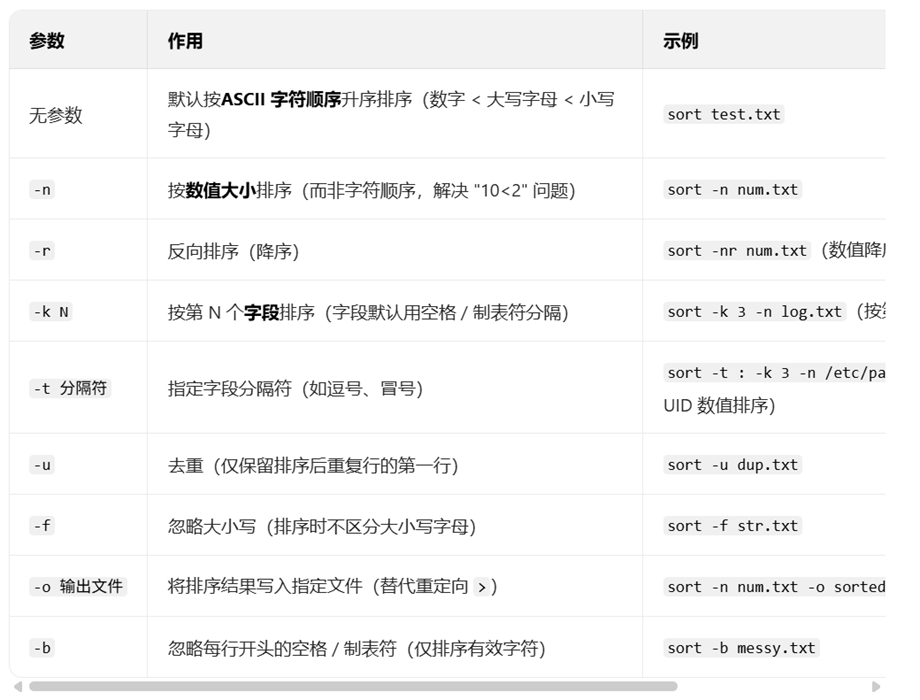

# uniq
核心作用是 “去重” 或 “统计重复次数”，但它有个关键前提：**仅对连续的重复行生效**，因此几乎总是和 **sort** 配合使用（先排序让重复行连续，再去重 / 统计）
也可以用以绕过读取

# file -f
File 用以识别文件类型

-f 指定一个文本文件，该文件的**每一行**对应一个要检测的文件路径（绝对路径 / 相对路径均可）

因此file -f flag.php意味着会检测php文件中每一行内容，因此会造成报错并且回显出原始内容
因为文件内容并不是一个真实的有效的路径

# grep
查找指定<mark style="background: #FFB8EBA6;">字符串</mark>
Grep fl fl*
第一个fl是匹配模式，匹配文件中含有fl的字符串
第二个为fl*通配符搜索fl开头的所有文件

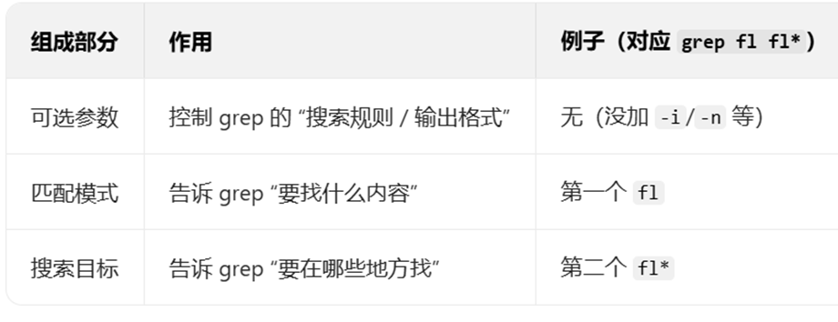

因此grep fl fl*就是在fl*的文件里面寻找有fl的内容

*可选参数

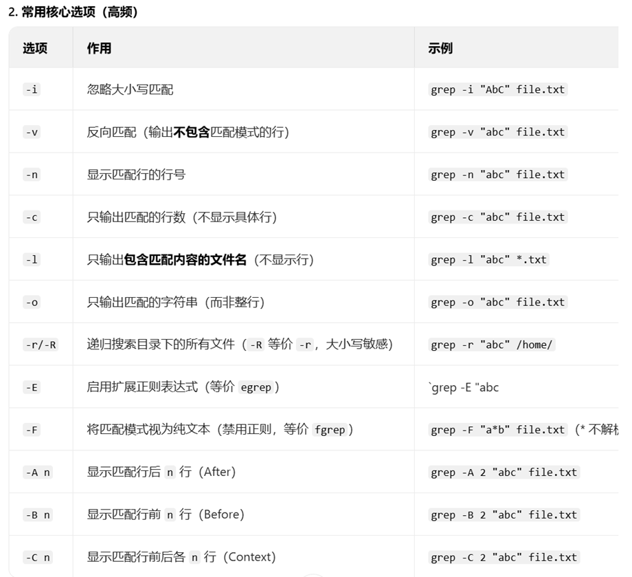

此时，又可以结合之前的管道符|将前面的命令作为后面的参数
例如cat f* | grep flag
等价于 grep flag f*

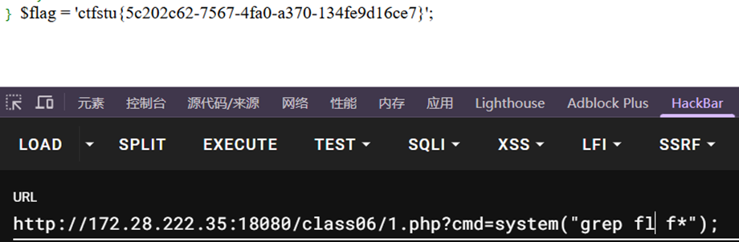

