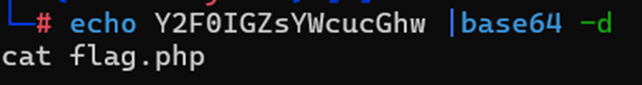
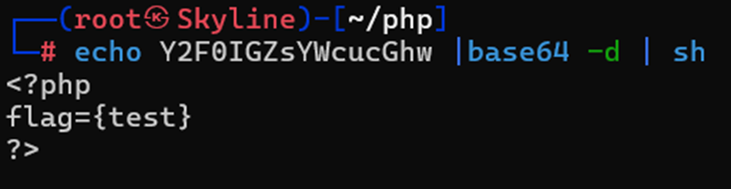
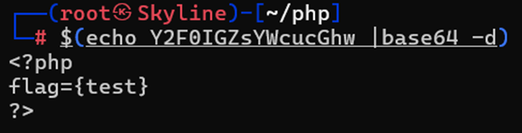
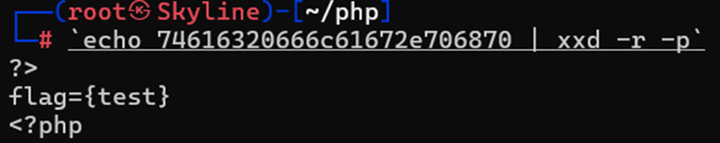
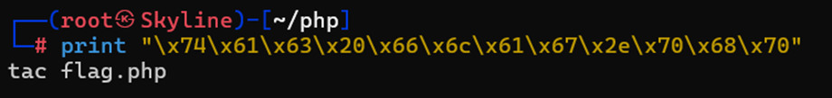
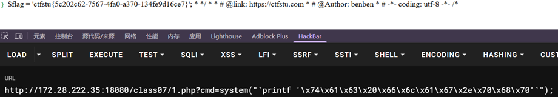

---
tags:
  - PHP
  - RCE
Date: 2026-01-09
---
# base64
Cat flag.php -> Y2F0IGZsYWcucGhw

意味着可以通过编码后解码得到需要的命令和参数
因此只需要解码后再执行
Zsh环境下，在最后可以再加入参数 | sh
让其变成命令去执行
以及bash等

在linux也可以使用反引号以及$()的形式`变成命令去执行

类似的还有base32等原理类似

# hex
ASCII码
例如tac flag.php -> 74616320666c61672e706870
(经过hex编码)

在Linux下执行 使用xxd查看
其中xxd –r -p的作用就是将hex编码还原

-r -p将纯十六进制转储的反向输出打印为了ASCII格式

# shellcode
在hackbar使用escape ascii with hex即可编码

并且一般需要使用printf来回显内容

