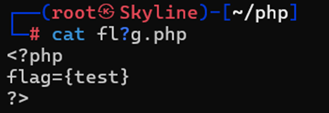
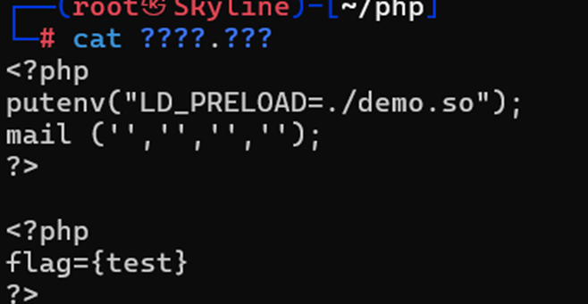
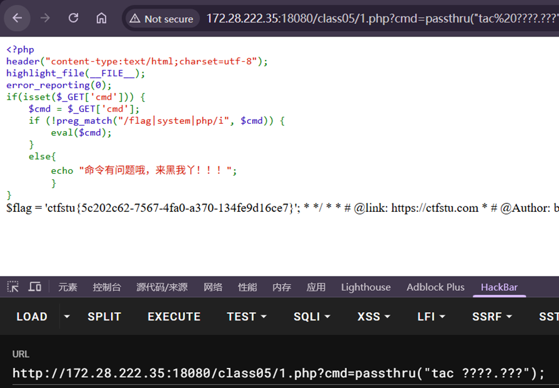
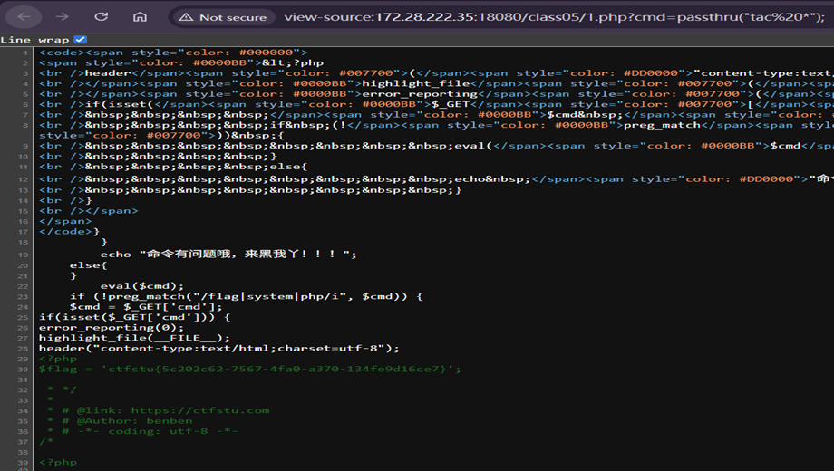
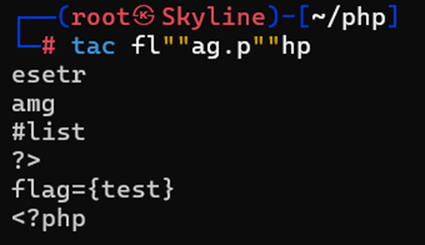
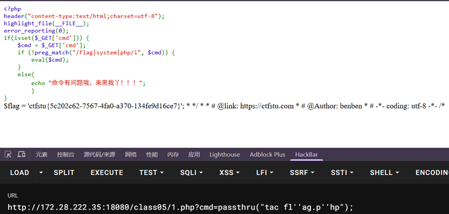
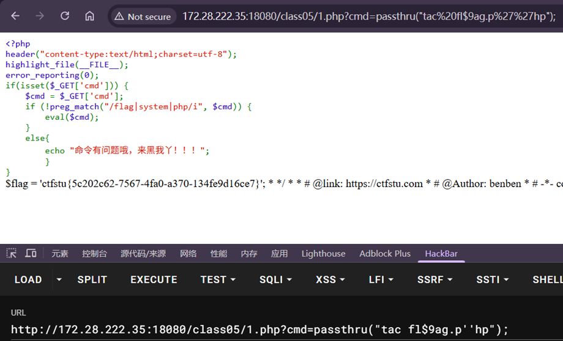

---
tags:
  - PHP
  - RCE
Date: 2026-01-08
---
# 通配符
## ？



?表示代替任一字符
所以会匹配任何符合fl?g.php形式的文件



甚至只需要相同的格式即可



## *
星号表示从当前位后面全部模糊匹配
例如：
cat /f* 就是匹配所有f开头的文件



# 引号' & "
单引号''或者双引号""
用以包裹空字符串，从而让系统识别为空，连接上前后的字符组成完整的命令
同时没有出现完整的过滤字符串，从而绕过





在passthru()包裹的指令里面已经被""包裹，因此绕过需要用单引号''
反之外层为单引号里层绕过就用双引号即可

# 反斜线
\可以过滤掉一些特殊含义字符的功能，仅仅输出字符的作用，例如某些情况$%#等符号以及连接其他字符有特殊含义和作用，使用\即可仅仅输出字符的功能
因此和C语言类似，为转义字符

例如上文提到的tac fl?g.php flag*.php
此时在?和*前面加上转义字符\则会实现精准匹配


# 特殊变量
例如$9这些没有实际含义的变量
可以实现''包裹类似的效果



# 内联执行
给不同的变量赋值最后组合成完整的命令
例如：
```php
a=fl;b=ag;c=ph;d=p;cat $a$b.$c$d
```
