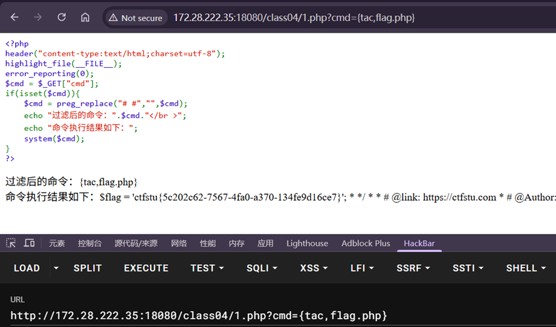
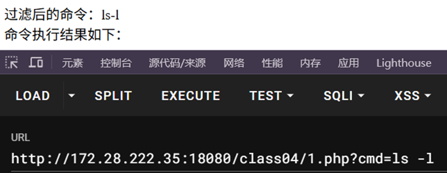
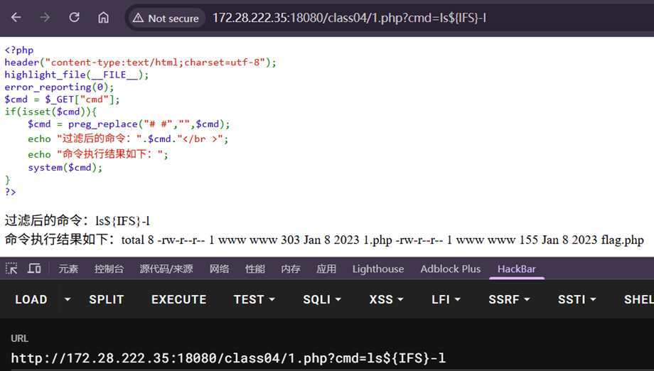
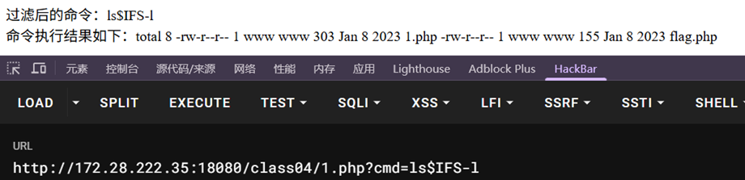
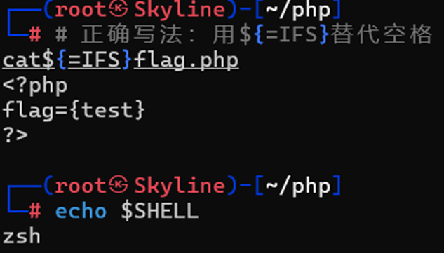
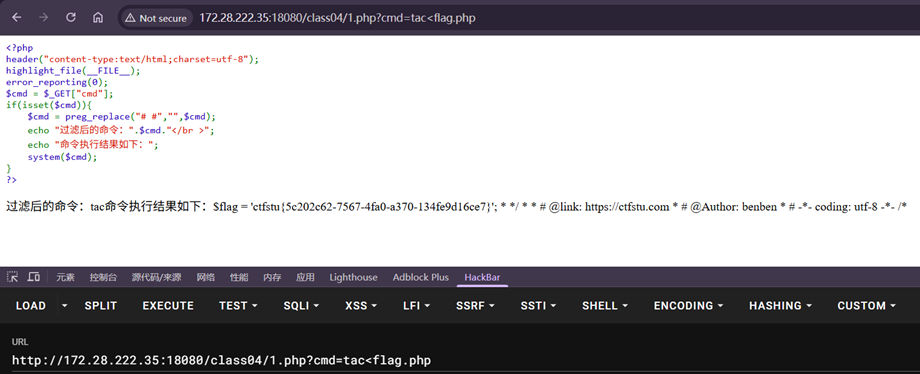

---
tags:
  - RCE
  - PHP
date: 2026-01-08
---
# 大括号拼接
{,}在大括号里面用逗号连接命令

# IFS代替
包含\$IFS,\${IFS},\$IFS\$9

Linux环境下，IFS为一个特殊的环境变量
--内部字段分隔符
单纯的$IFS可能被当作变量名，因此可添加大括号
$IFS$9后面的$起截断作用，$9是当前系统shell进程的第九个参数持有者，为空字符串

此时没有空格的时候可以正常执行
尝试执行ls -l

空格被过滤-替换为空字符因此没有识别正确命令

因此需要如上述替换--$IFS或者${IFS}

在实际操作中，靶机在识别$IFS$9以及$2等标识，都可以代替空格使用

### 在zsh环境下
使用${=IFS}也可以代替空格

# 重定向字符绕过
< 
<> 
<表示重定向，把<后面的文件当作键盘输入
例如tac<flag.php

使用重定向符号可以将读取文件tac等指令辅助绕过空格，而ls -l这类指令则不行
*它不能完全代替空格，只是辅助了tac等命令读取到对应文件，也就是重定向*
同时使用<>也可以有相同的效果
但是由于>有创建文件的作用，可能在实际使用中会生成出文件

# URL编码绕过
%09—TAB
%20—SPACE
可以通过将空格替换成制表符或者空格对应的url编码

