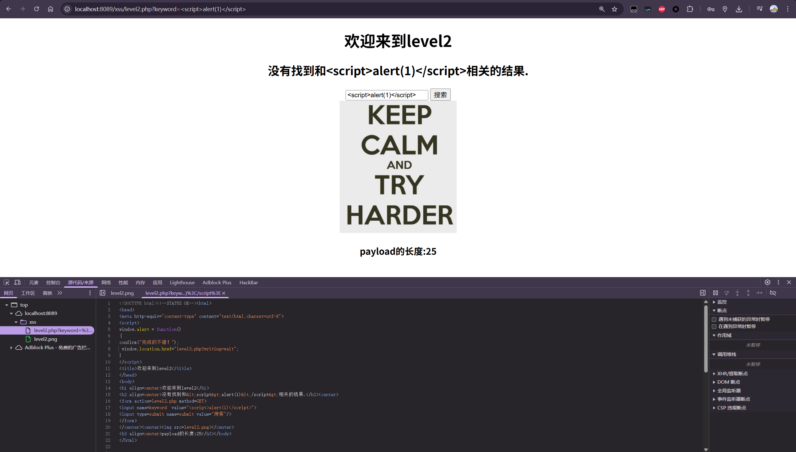

### L1
```html
<script>
window.alert = function()  
{     
confirm("完成的不错！");
 window.location.href="level2.php?keyword=test"; 
}
</script>
```
在源码中看到script的源码

- **`window` 对象：** 在浏览器中，`window` 是老大，代表当前的浏览器窗口。所有的全局变量和函数都是它的属性。
    
- **`window.alert`：** 这是浏览器自带的函数，原本的作用是弹出一个带“确定”按钮的警告框（比如 `alert(1)`）。
    
- **重写（Override）：** 这行代码并没有调用 alert，而是**给它重新赋值了**。
    
    - 它把 `window.alert` 变成了一个**自定义的函数**。
        
    - **这意味着：** 之后在这个页面上，如果有任何代码（包括你注入的攻击代码）尝试执行 `alert('任何东西')`，浏览器不再弹出原本的警告框，而是**执行大括号 `{ ... }` 里的这段新代码**。
        

> **为什么要这么做？** 靶场的过关条件通常是“证明你能执行 JS 代码”。最简单的证明方式就是让你弹出一个 `alert`。 为了自动判断你是否成功，靶场作者修改了 `alert` 的行为：**只要你的攻击脚本成功触发了 `alert`，就视为通关**，自动运行下面的庆祝和跳转逻辑。

普通的一个alert应该是这样：

```js
// 完整写法
window.alert("我是原本的弹窗！");

// 简写（最常用）
alert("我是原本的弹窗！");
```

关卡源码被自定义hook过，所以才会跳转下一关

最终payload:
```js
<script>
alert('test')
</script>
```


### L2



再次沿用直接测试弹窗发现，没有被当作标签触发
原因可以在源代码看到
```html
```