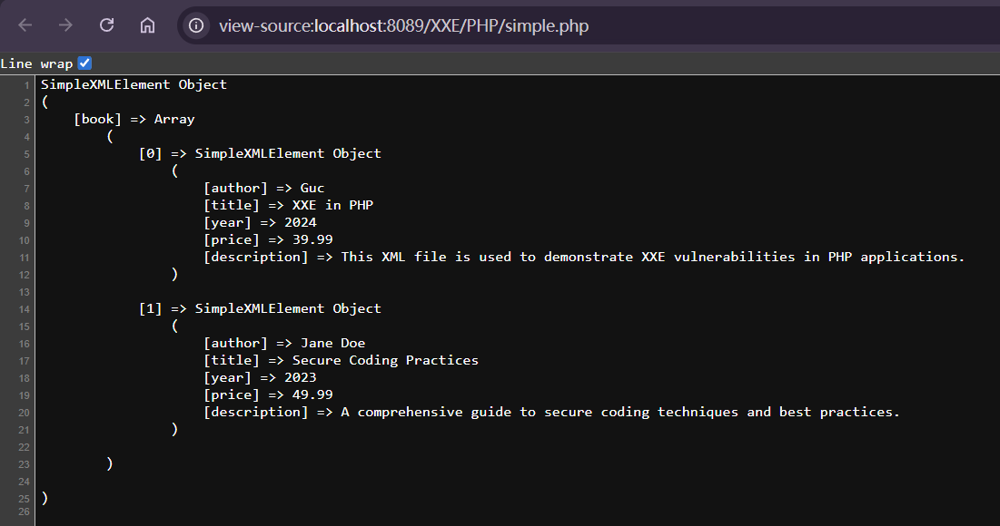

---
tags:
  - PHP
  - WEB
  - XML
date: 2026-01-03
---
## 创建一份xml示例文件

```XML
<?xml version="1.0" encoding="utf-8"?>

<info>

    <book>

        <author>Guc</author>

        <title>XXE in PHP</title>

        <year>2024</year>

        <price>39.99</price>

        <description>This XML file is used to demonstrate XXE vulnerabilities in PHP applications.</description>

    </book>

    <book>

        <author>Jane Doe</author>

        <title>Secure Coding Practices</title>

        <year>2023</year>

        <price>49.99</price>

        <description>A comprehensive guide to secure coding techniques and best practices.</description>

    </book>

</info>
```

## 方式一
### 使用simplexml_load_file()函数
构建php文件，定义一个变量存储函数内容，然后print_r打印
```php
<?php

$xml = simplexml_load_file("test.xml");

print_r($xml);

?>
```

页面回显如下：



回显内容组成对象
book作为属性
用数组的方式回显了xml的内容
分别对应0/1的具体内容，并且再次嵌套一个对象，属性分别是author等内容

因此可以分别调用其内部属性
例如先调用xml的book[0]
在调用book[0]下的title属性

```php
print_r($xml->book[0]);

echo $xml->book[0]->title;
```

结果回显：

```php
SimpleXMLElement Object
(
    [book] => Array
        (
            [0] => SimpleXMLElement Object
                (
                    [author] => Guc
                    [title] => XXE in PHP
                    [year] => 2024
                    [price] => 39.99
                    [description] => This XML file is used to demonstrate XXE vulnerabilities in PHP applications.
                )

            [1] => SimpleXMLElement Object
                (
                    [author] => Jane Doe
                    [title] => Secure Coding Practices
                    [year] => 2023
                    [price] => 49.99
                    [description] => A comprehensive guide to secure coding techniques and best practices.
                )

        )

)
SimpleXMLElement Object
(
    [author] => Guc
    [title] => XXE in PHP
    [year] => 2024
    [price] => 39.99
    [description] => This XML file is used to demonstrate XXE vulnerabilities in PHP applications.
)
XXE in PHP
```

## 方式二 DOMDocument
数据通常以POST方式把字符串提交进去，以xml结构提交给目标网站，再通过php伪协议读取内容，进行xml解析

### DOMDocument是一个类
要使用其读取xml文件，首先需要实例化一个对象

```php
<?php

$xml = file_get_contents("test.xml");//读取xml文件内容，此时是字符串

$doc = new DOMDocument();//实例化DOMDocument类

$doc->loadXML($xml);//加载xml字符串

print_r($doc -> saveXML());//输出xml内容

?>
```

### 这里需要注意读取xml文件的时候使用file_get_contents()函数，而不是include()函数，因为要以字符串的形式读取，不然会被当作php文件执行从而报错


此时是直接展示了每一块的内容在页面上

```php
<?php

$doc = new DOMDocument();//实例化DOMDocument类

$doc->load("test.xml");//加载xml

print_r($doc -> saveXML());//输出xml内容
```

也可以使用`load()`函数直接加载xml文件，达到一样的效果

### 如果要读取某一个节点的值
需要使用到函数`getElementsByTagName("name")`
传入要读取的节点的名称，再指向第几个元素，最后使用nodevalue

```php
echo $doc->getElementsByTagName("title")->item(0)->nodeValue;//获取第一个title节点的值
echo $doc->getElementsByTagName("title")->item(1)->nodeValue;//获取第二个title节点的值
```


## 混合读取

