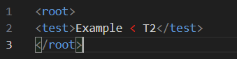
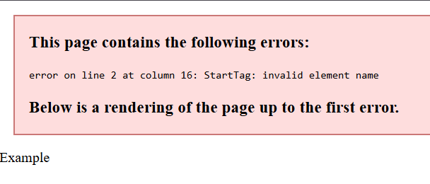

---
tags:
  - XML
  - WEB
Date: 2026-01-03
---
### 对比HTML
#### XML标签需要闭合

```HTML
<p>This is a test.
```
在HTML标签不闭合是被允许的

```XML
<p>This is a test.</p>
```
而XML标签则必须闭合

### 大小写敏感

```XML
<t1>False</T1>
<t2>True</t2>
```
闭合标签需要一致的形式

### XML必须有根元素
XML必须有一个元素是其他元素的父元素，可以有多个枝节元素

### 实体引用
在XML中，一些字符有特殊含义
例如`<`会被当作新元素的开始
`<message>This is a < message.</message>`
这时就会报错，因为中间的<会导致识别错误
源代码如下：

报错提示：

这时只显示了Example，而没有后续的 < T2，并且从此处发生了报错

#### 因此，XML语言自带几个预定义的实体引用

| 定义符号     | 实际符号 | 含义  |
| -------- | ---- | --- |
| `&lt;`   | <    | 小于  |
| `&gt;`   | >    | 大于  |
| `&amp;`  | &    | 和   |
| `&apos;` | '    | 单引号 |
| `&quot;` | "    | 双引号 |
通过调用实体进行呈现

通过漏洞进行读取的内容也可以定义成实体最后引用呈现出来
