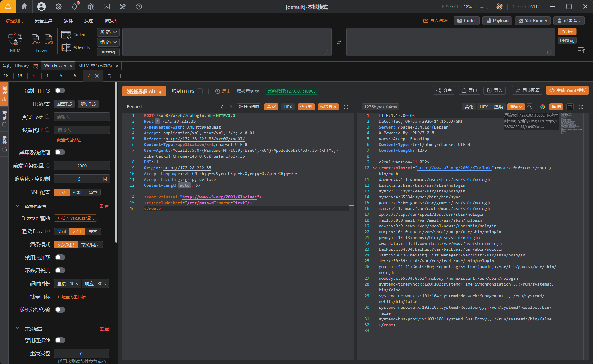

---
tags:
  - XXE
  - XML
  - WEB
Date: 2026-01-06
---
## 什么是 XInclude？

XInclude 是 XML 标准的一部分，用于在一个 XML 文档中包含<mark style="background: #FFB8EBA6;">另一个 XML 文档</mark>的内容。它类似于编程中的"引入"或"导入"功能，有助于更好地组织和重用 XML 内容。

### 主要用途：

- **内容重用**：将通用内容放在单独文件中，在多个文档中引用
- **模块化管理**：将大型 XML 文档拆分为多个小文件，便于维护
- **简化更新**：修改被包含的文件，所有引用它的文档都会自动更新

### 基本语法：

首先需要声明 XInclude 命名空间，然后使用 <xi:include> 元素引用外部文件：

```XML
<!-- 声明命名空间 --> <root xmlns:xi="http://www.w3.org/2001/XInclude"> 
<!-- 包含外部 XML 文件 --> <xi:include href="header.xml"/> 
<!-- 文档主体内容 --> <content>这是主文档内容</content> 、
<!-- 包含另一个文件 --> <xi:include href="footer.xml"/> </root>
```

### 功能类似于php include

## 与外部实体的区别

外部实体：无法成为一个成熟的独立的XML文档。不允许独立的XML声明和DTD声明
Xinclude：可以调用一个独立完整的XML内容。

## 与PHP文件包含的区别

php：直接调用include()函数
Xinclude：使用前需要做前缀声明
例如：`<root xmlns:xi="http://www.w3.org/2001/XInclude">` -->官方xinclude路径
用以声明xi:include的标签

### 常见安全风险

- **路径遍历攻击**：恶意构造路径访问敏感文件
    甚至是http伪协议
- **服务器端请求伪造(SSRF)**：通过URL访问内网资源
    
- **拒绝服务(DoS)**：超大文件或嵌套包含耗尽资源
    
- **恶意内容注入**：包含被篡改的文件
    

### 防护建议

- **验证输入**：限制href为预定义的安全路径
    
- **禁用外部URL**：只允许包含本地文件
    
- **限制大小和深度**：防止DoS攻击
    
- **禁用外部实体**：防止XXE漏洞

### 靶场利用
```xml
<root xmlns:xi="http://www.w3.org/2001/XInclude">
<xi:include href="/etc/passwd" parse="text"/>
</root>
```
在声明xinclude末尾没有斜杠
包含xml文件的末尾有斜杠



