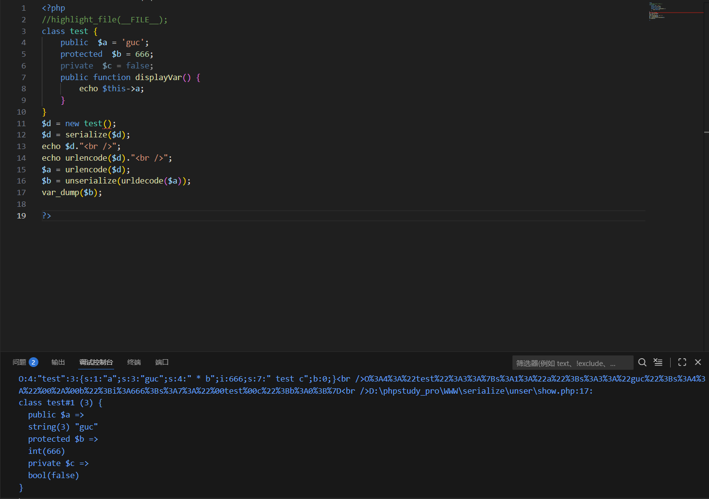
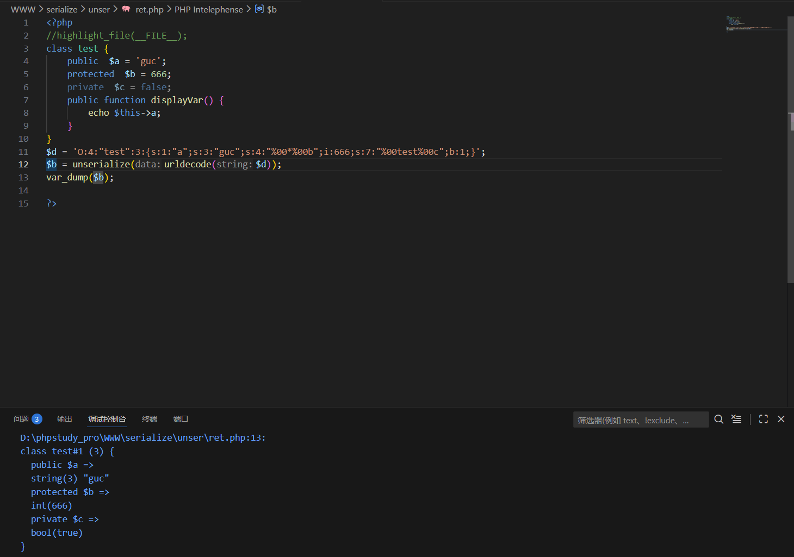

---
tags:
  - PHP
  - serialize
Date: 2026-01-10
---
### 反序列化之后的内容为一个对象

### 反序列化生成的对象里的值，由序列化里的值提供，与原有类预定义无关^1

### 反序列化不触发类的成员方法；需要调用方法后才能触发

# 反序列化的作用
将序列化后的参数还原成实例化的对象

对象->字符串--序列化
字符串->对象--反序列化



$d实例化对象
```php
O:4:"test":3:{s:1:"a";s:6:"benben";s:4:"*b";i:666;s:7:"testc";b:0;}
```
然后进行序列化
```php
O%3A4%3A%22test%22%3A3%3A%7Bs%3A1%3A%22a%22%3Bs%3A6%3A%22benben%22%3Bs%3A4%3A%22%00%2A%00b%22%3Bi%3A666%3Bs%3A7%3A%22%00test%00c%22%3Bb%3A0%3B%7D
```
#### 需要注意
class里面的变量ab仅在实例化对象时候使用
在后续使用ab变量url编码对象和反序列化对象的时候不受影响
```php
var_dump($b);

class test#1 (3) {

public $a =>

string(3) "guc"

protected $b =>

int(666)

private $c =>

bool(false)

}
```



将原有的获取的实例化对象提取出来单独赋值给变量后
自己编辑更改后再次反序列化
### 注意
此时对应的protected和private属性需要对应的url编码符号
![[PHP反序列化原理#^1]]