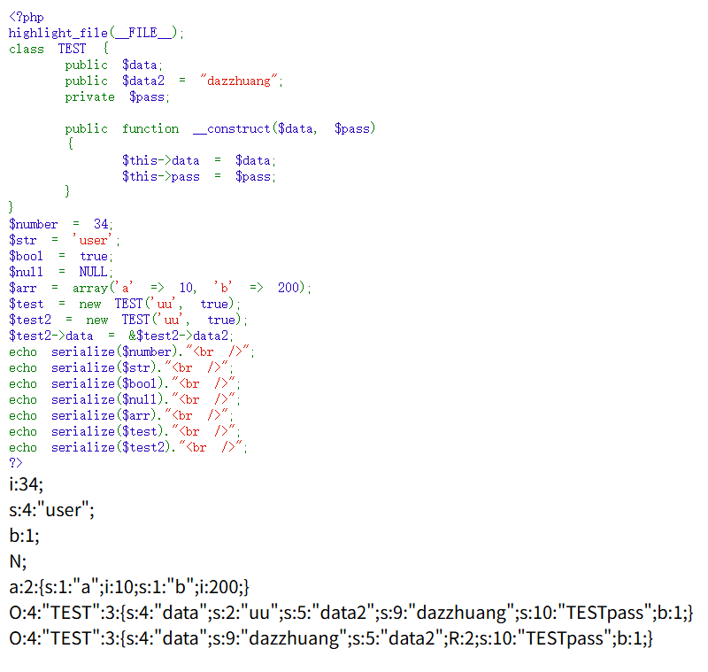
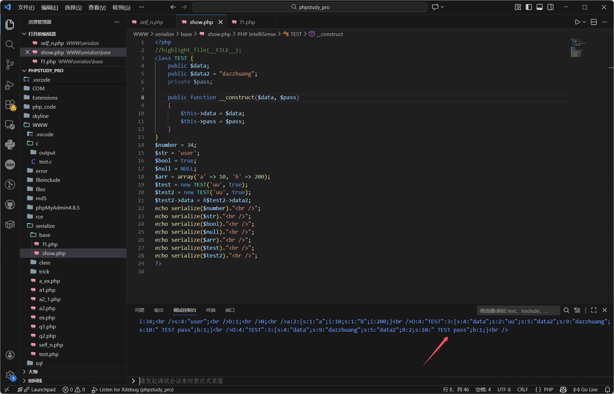
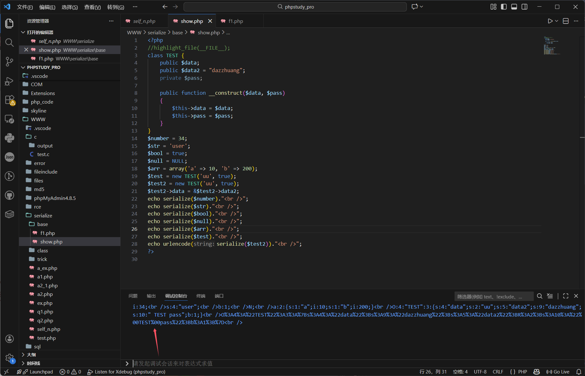

---
tags:
  - PHP
  - serialize
Date: 2026-01-10
---
# 序列化基础
序列化是将对象的状态信息（属性）转换为可以存储或传输的形式的过程
对象-->字符串
将对象或者数组转化为字符串

## 类型
类型显示后会接着内容，并且末尾有分号闭合;
## 空字符
null对应N
## 整型
int对应i，例如i:34;
## 浮点型
double对应d;
## 布尔类型
bool对应b;
## 字符串类型
string对应s，并且s:4:"user";首先回显字符串长度再是内容
*即使字符串内有双引号，也会被正常识别，前面的长度会对应增加*
*仅将最外层识别为闭合符*
## 数组
对于$arr是数组，则会有a作为array标识符，紧接参数数量，然后是参数内容
`a:2:{s:1:"a";i:10;s:1:"b";i:200;}`
## 对象
对于类和对象
<mark style="background: #FFB8EBA6;">类</mark>不可被序列化
<mark style="background: #FFB8EBA6;">对象</mark>可以被序列化
`O:4:"TEST":3:{s:4:"data";s:2:"uu";s:5:"data2";s:9:"dazzhuang";s:10:"TESTpass";b:1;}`
O标识对象
4和TEST是对象的类的名称以及长度
3个属性/变量内容分别展示属性和值
<mark style="background: #FFB8EBA6;">私有属性</mark>序列化的时候：在变量名前加"%00类名%00"
``s:10:"TESTpass";b:1;
因此这时的属性字符串长度多了2个长度为空的NULL

urlencode编码后查看

