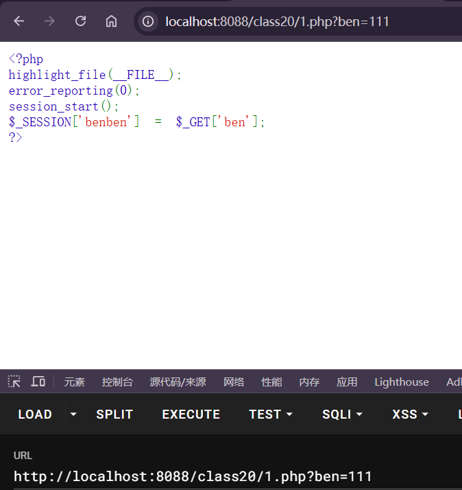
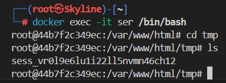

---
tags:
  - PHP
  - serialize
  - session
Date: 2026-01-31
---
当session_start()被调用或者php.ini中session.auto_start为1时
PHP内部调用会话管理器，访问用户session被序列化以后，存储到指定目录（默认为/tmp）。
存取数据的格式有多种，常用的有三种

### 漏洞产生原因
写入格式和读取格式不一样

在网页提交字符串后，查看tmp文件夹

