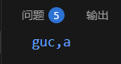
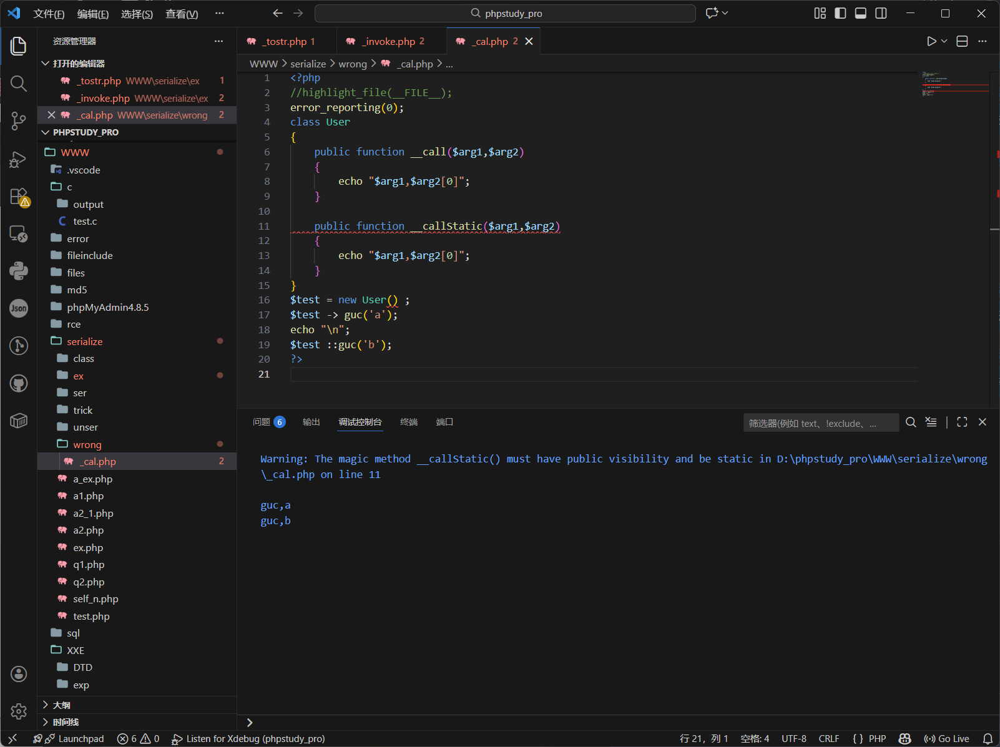
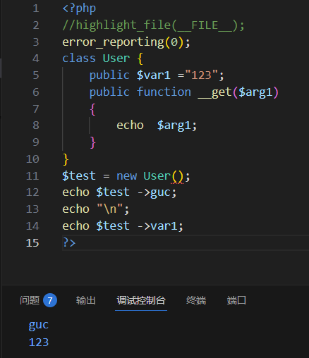

# \_\_call
当调用了一个不存在的方法的时候触发
参数：2个参数传参\$arg1,\$arg2
返回值：调用不存在的方法名称和参数

```php
<?php

//highlight_file(__FILE__);

error_reporting(0);

class User {

    public function __call($arg1,$arg2)

    {

        echo "$arg1,$arg2[0]";

          }

}

$test = new User() ;

$test -> guc('a');

?>
```



调用不存在的函数guc()和参数a分别按照格式回显

# \_\_callStatic
静态调用或者调用成员常量时使用的方法不存在时触发
参数和返回值同\_\_call

```php
<?php

//highlight_file(__FILE__);

error_reporting(0);

class User

{

    public function __call($arg1,$arg2)

    {

        echo "$arg1,$arg2[0]";

    }

  

    public function __callStatic($arg1,$arg2)

    {

        echo "$arg1,$arg2[0]";

    }

}

$test = new User() ;

$test -> guc('a');

echo "\n";

$test ::guc('b');

?>
```



注意：静态调用为::
普通调用为->

# \_\_get
与call类似，调用的成员属性不存在的时候触发
传参\$arg1
返回不存在的成员属性名称
```php
<?php

//highlight_file(__FILE__);

error_reporting(0);

class User {

    public $var1 ="123";

    public function __get($arg1)

    {

        echo  $arg1;

    }

}

$test = new User();

echo $test ->guc;

echo "\n";

echo $test ->var1;

?>
```



# \_\_set
进一步的get，当调用不存在的成员属性并且赋值的时候触发

```php
<?php

//highlight_file(__FILE__);

error_reporting(0);

class User {

    public $var1 ="123";

    public function __get($arg1)

    {

        echo  $arg1;

    }

  

    public function __set($arg1,$arg2)

    {

        echo  $arg1 ."," .$arg2;

    }

}

$test = new User();

echo $test ->guc;

echo "\n";

echo $test ->var1;

echo "\n";

  

echo $test ->guc = '456';

echo "\n";

echo $test ->var1 = '789';

?>
```

