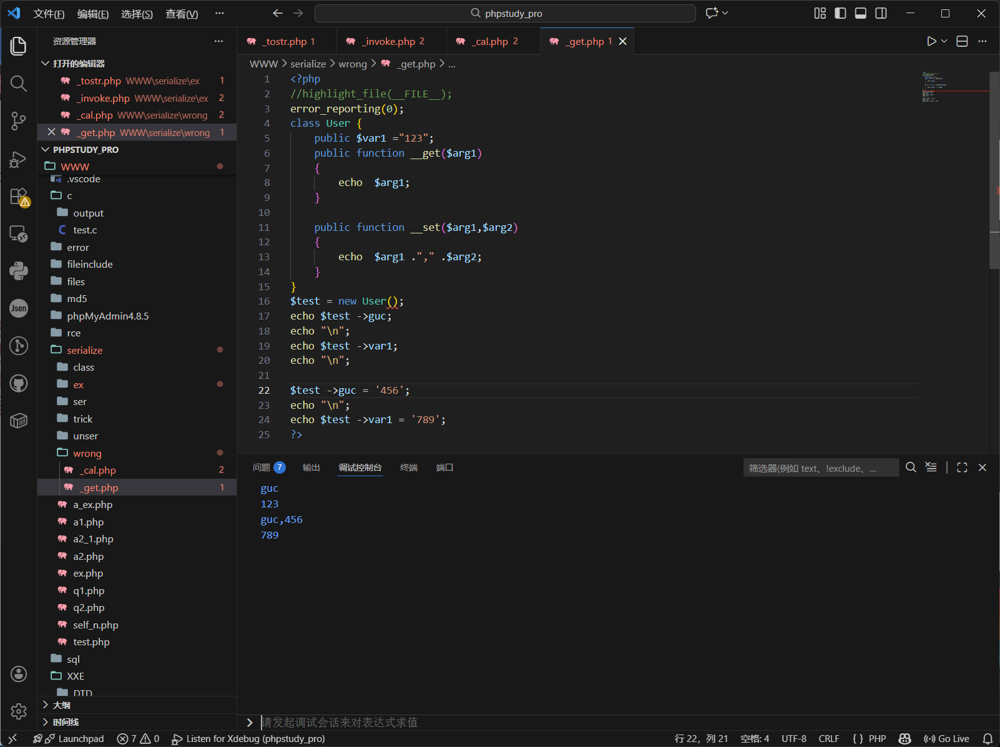
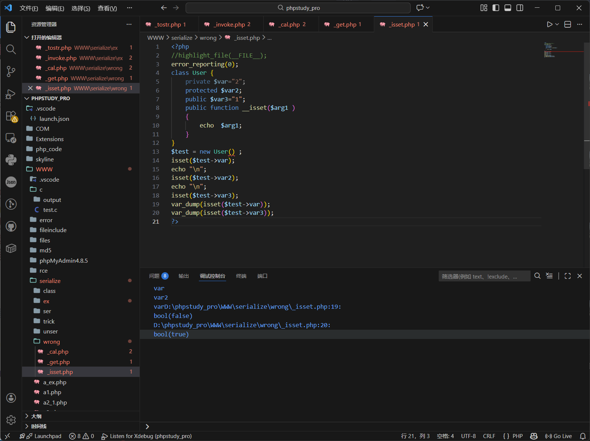
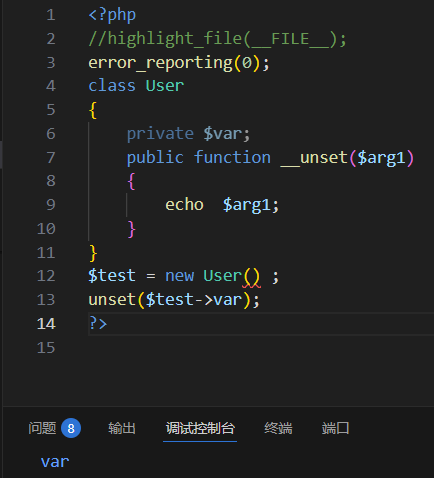
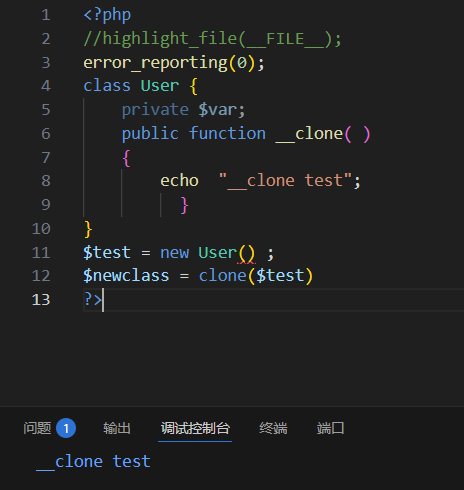

# \_\_call
当调用了一个不存在的方法的时候触发
参数：2个参数传参\$arg1,\$arg2
返回值：调用不存在的方法名称和参数

```php
<?php

//highlight_file(__FILE__);

error_reporting(0);

class User {

    public function __call($arg1,$arg2)

    {

        echo "$arg1,$arg2[0]";

          }

}

$test = new User() ;

$test -> guc('a');

?>
```


调用不存在的函数guc()和参数a分别按照格式回显

# \_\_callStatic
静态调用或者调用成员常量时使用的方法不存在时触发
参数和返回值同\_\_call

```php
<?php

//highlight_file(__FILE__);

error_reporting(0);

class User

{

    public function __call($arg1,$arg2)

    {

        echo "$arg1,$arg2[0]";

    }

  

    public function __callStatic($arg1,$arg2)

    {

        echo "$arg1,$arg2[0]";

    }

}

$test = new User() ;

$test -> guc('a');

echo "\n";

$test ::guc('b');

?>
```


注意：静态调用为::
普通调用为->

# \_\_get
与call类似，调用的成员属性不存在的时候触发
传参\$arg1
返回不存在的成员属性名称
```php
<?php

//highlight_file(__FILE__);

error_reporting(0);

class User {

    public $var1 ="123";

    public function __get($arg1)

    {

        echo  $arg1;

    }

}

$test = new User();

echo $test ->guc;

echo "\n";

echo $test ->var1;

?>
```


# \_\_set
进一步的get，当调用不存在的成员属性并且赋值的时候触发

```php
<?php

//highlight_file(__FILE__);

error_reporting(0);

class User {

    public $var1 ="123";

    public function __get($arg1)

    {

        echo  $arg1;

    }

  

    public function __set($arg1,$arg2)

    {

        echo  $arg1 ."," .$arg2;

    }

}

$test = new User();

echo $test ->guc;

echo "\n";

echo $test ->var1;

echo "\n";

  

$test ->guc = '456';

echo "\n";

echo $test ->var1 = '789';

?>
```



# \_\_isset
对不可访问属性使用isset或者empty的时候会被调用
传参\$arg1
返回不存在的成员属性的名称

```php
<?php

//highlight_file(__FILE__);

error_reporting(0);

class User {

    private $var="2";

    protected $var2;

    public $var3="1";

    public function __isset($arg1 )

    {

        echo  $arg1;

    }

}

$test = new User() ;

isset($test->var);

echo "\n";

isset($test->var2);

echo "\n";

isset($test->var3);

echo "\n";

var_dump(isset($test->var));

var_dump(isset($test->var3));

?>
```



isset会判断是否存在/可读，本身判断后有bool值，var_dump->var3的时候为真，var不可读为假

# \_\_unset
isset对应的unset

|对比项|__isset()|__unset()|
|---|---|---|
|触发函数|`isset()` / `empty()`|`unset()`|
|是否返回值|✅ bool|❌ 无|
|是否修改数据|❌ 不修改|✅ 可修改|
|是否真正删除属性|❌|❌（需手动）|
|常见用途|判断存在性|删除 / 触发副作用|
|安全影响|条件绕过|行为触发|

```php
<?php

//highlight_file(__FILE__);

error_reporting(0);

class User {

    private $var;

    public function __unset($arg1 )

    {

        echo  $arg1;

    }

}

$test = new User() ;

unset($test->var);

?>
```



unset会回显任何属性

# \_\_clone
当使用clone关键词拷贝完成一个新的对象，对象会自动调用定义的魔术方法clone()
```php
<?php

//highlight_file(__FILE__);

error_reporting(0);

class User {

    private $var;

    public function __clone( )

    {

        echo  "__clone test";

          }

}

$test = new User() ;

$newclass = clone($test)

?>
```



