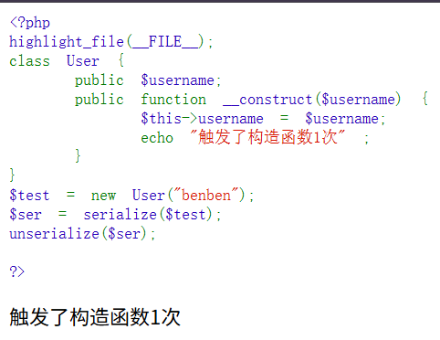
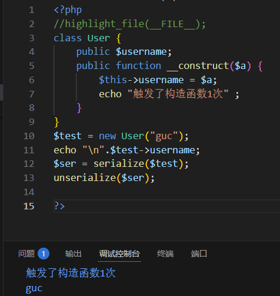
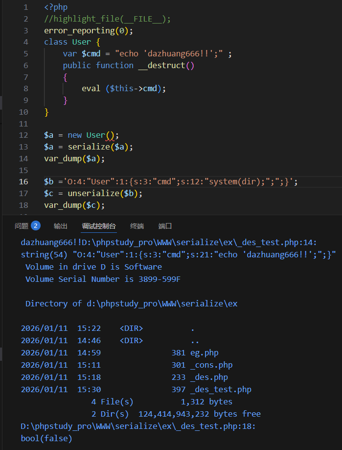
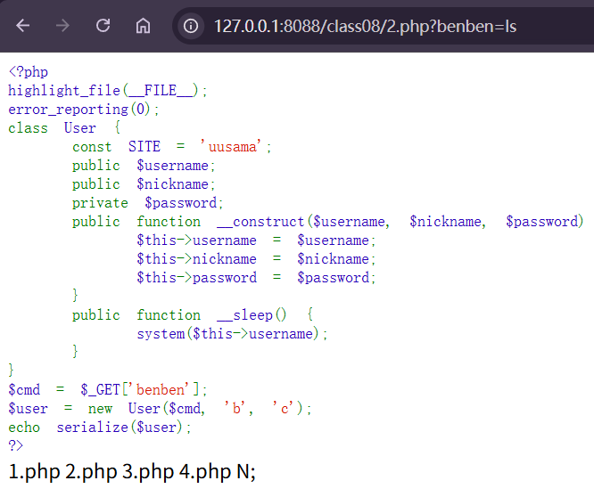

---
tags:
  - serialize
  - PHP
Date: 2026-01-11
---
# 魔术方法
一个预定义好的，在特定情况下自动触发的行为方法

## 作用
由于反序列化unserialize()接收的值可控，因此通过调用方法触发代码执行

## 相关机制
<mark style="background: #FFB8EBA6;">触发时机</mark>
功能
<mark style="background: #FFB8EBA6;">参数</mark>
返回值

# \_\_construct()
构造函数
在实例化对象的时候就会触发





\$this也代表当前对象
由此可见__construct函数在实例化对象的时候会自动触发执行

<mark style="background: #FFB8EBA6;">参数部分</mark>
是非必要传入的，具体看方法内部
### 对比序列化和反序列化的过程
只有魔术方法在此条件下触发

# \_\_destruct
与construct函数对称的
<mark style="background: #FFB8EBA6;">析构函数</mark>
在对象的所有引用被删除或者当对象被显式销毁时执行的魔术方法
```php
<?php

//highlight_file(__FILE__);

class User {

    public function __destruct()

    {

        echo "触发了析构函数1次"."<br />" ;

    }

}

$test = new User("benben");

$ser = serialize($test);

unserialize($ser);

  

?>
```


在new实例化对象完成后触发一次
在序列化的时候不受影响
反序列化之后重新由字符串转为对象再次触发一次



```php
<?php

//highlight_file(__FILE__);

error_reporting(0);

class User {

    var $cmd = "echo 'dazhuang666!!';" ;

    public function __destruct()

    {

        eval ($this->cmd);

    }

}

  

$a = new User();

$a = serialize($a);

var_dump($a);

  

$b ='O:4:"User":1:{s:3:"cmd";s:12:"system(dir);";";}';

$c = unserialize($b);

var_dump($c);
```
首先在$a实例化对象后执行了一次析构函数，触发原本的代码echo
$b是针对User属性cmd的参数更改
$c 由 $b反序列化后得到的对象再次触发析构函数执行dir

# \_\_sleep
序列化serialize执行之前会检查类中是否含有sleep()函数
如果含有的话，则该魔术方法会先触发，在执行序列化
## 功能
返回需要被序列化存储的成员属性，删除不必要属性
如果没有返回任何内容，则NULL被序列化，并产生一个E_NOTICE级别错误


在实例化对象后，三个成员属性都被赋值
在序列化之前触发了sleep方法，只返回了前两个public属性
最后在序列化后只回显sleep返回的属性



例题的username属性被用以在序列化前触发，此时没有return所以回显N
同时system执行了ls
