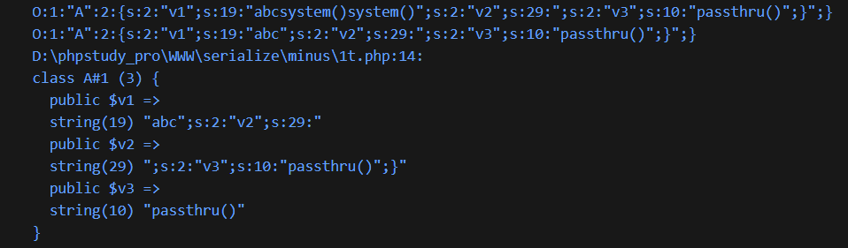
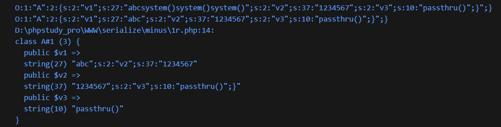
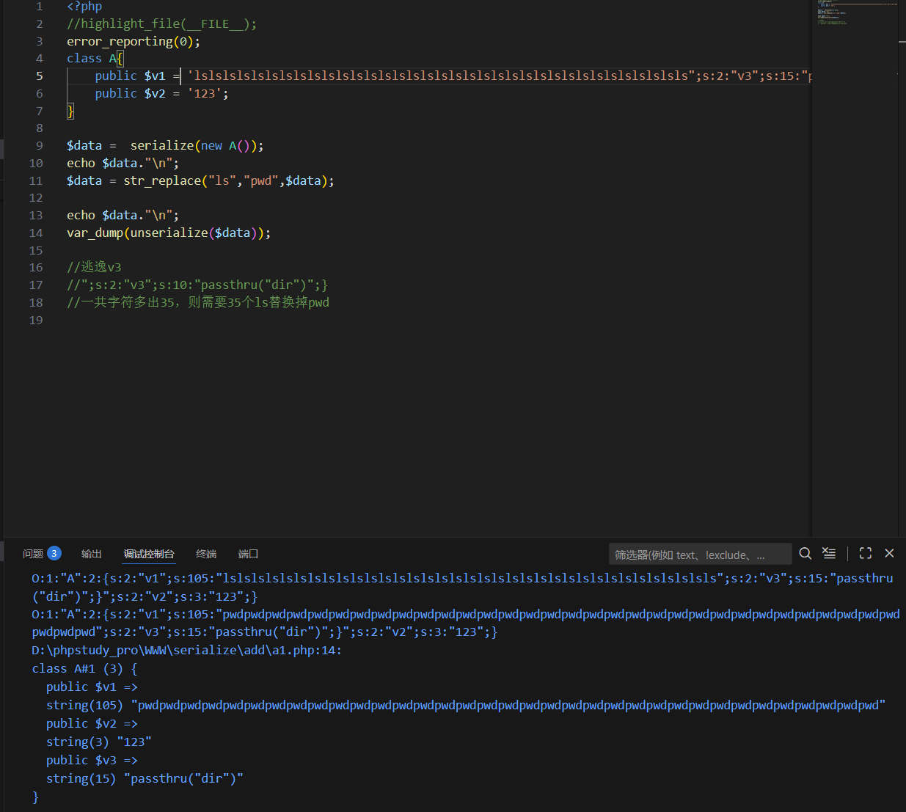
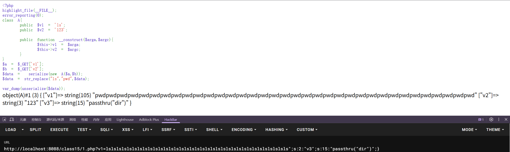

---
tags:
  - PHP
  - serialize
Date: 2026-01-29
---
一般在数据先经过依次序列化后再反序列化，在中间反序列化的字符串变多或者变少的时候才可能存在属性逃逸

# 减少逃逸

例如：
```php
<?php
//highlight_file(__FILE__);
error_reporting(0);
class A{
    public $v1 = "abcsystem()system()system()";
    public $v2 = '123';
}

$data = serialize(new A());
echo $data."\n";

$data = str_replace("system()","",$data);
echo $data."\n";

var_dump(unserialize($data));
?>
```
利用replace函数可以过滤序列化字符串的数据


此时vardump也会因为数据不对报错

p1.
利用2个system()刚好能够利用29\;末尾的引号闭合
（刚好是v2字符串开始的标识）
```php
<?php
//highlight_file(__FILE__);
error_reporting(0);
class A{
    public $v1 = "abcsystem()system()";
    public $v2 = ';s:2:"v3";s:10:"passthru()";}';
}

  

$data = serialize(new A());
echo $data."\n";

$data = str_replace("system()","",$data);
echo $data."\n";
var_dump(unserialize($data));
?>
```



p2.
利用更多的system()---3个，因此需要在v2部分添加内容，并且最后一位添加双引号用来闭合v1
对应1234567的七位加上一位"，对比上述多了一个八位的system()
```php
<?php
//highlight_file(__FILE__);
error_reporting(0);
class A{
    public $v1 = "abcsystem()system()system()";
    public $v2 = '1234567";s:2:"v3";s:10:"passthru()";}';
}

  

$data = serialize(new A());
echo $data."\n";

$data = str_replace("system()","",$data);
echo $data."\n";
var_dump(unserialize($data));
?>
```



# 增多逃逸

同样也是利用了replace函数，例如将ls替换成pwd，则会多出一个字符，因此考虑计算需要的功能性字符串后增加
```php
<?php

//highlight_file(__FILE__);

error_reporting(0);

class A{
    public $v1 = 'lslslslslslslslslslslslslslslslslslslslslslslslslslslslslslslslslslsls";s:2:"v3";s:15:"passthru("dir")";}';
    public $v2 = '123';
}

  

$data =  serialize(new A());
echo $data."\n";
$data = str_replace("ls","pwd",$data);

  

echo $data."\n";
var_dump(unserialize($data));

  

//逃逸v3

//";s:2:"v3";s:15:"passthru("dir")";}

//一共字符多出35，则需要35个ls替换掉pwd
```



都需要注意的是，比如本身class只定义了2个属性，但是逃逸出了另外的属性，则会在序列化后增加进去，原来定义的不变，自定义的优先
例如增加逃逸的v3是自定义的，v2则是原本定义的，v1是被过滤后的



```php
O:1:"A":2:{s:2:"v1";s:105:"pwdpwdpwdpwdpwdpwdpwdpwdpwdpwdpwdpwdpwdpwdpwdpwdpwdpwdpwdpwdpwdpwdpwdpwdpwdpwdpwdpwdpwdpwdpwdpwdpwdpwdpwd";s:2:"v3";s:15:"passthru("dir")";}";s:2:"v2";s:3:"123";}
```
并且由序列化结果得到的字符串，在第一个;}已经闭合，因此和后面关于v2的字符串无用