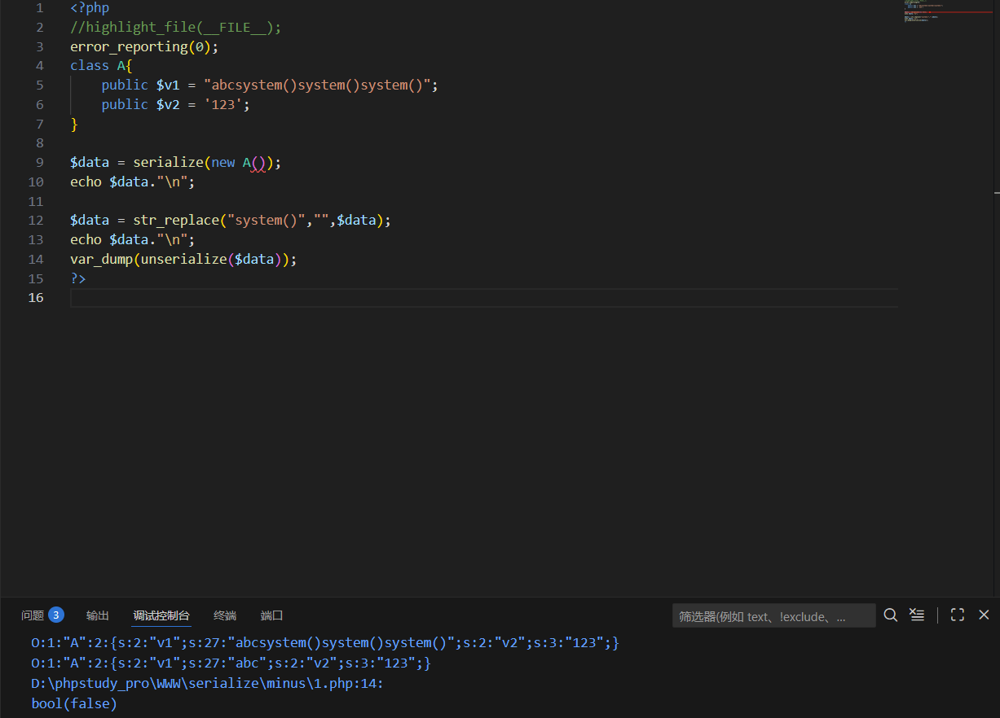

---
tags:
  - PHP
  - serialize
Date: 2026-01-29
---
一般在数据先经过依次序列化后再反序列化，在中间反序列化的字符串变多或者变少的时候才可能存在属性逃逸

例如：
```php
<?php
//highlight_file(__FILE__);
error_reporting(0);
class A{
    public $v1 = "abcsystem()system()system()";
    public $v2 = '123';
}

$data = serialize(new A());
echo $data."\n";

$data = str_replace("system()","",$data);
echo $data."\n";

var_dump(unserialize($data));
?>
```
利用replace函数可以过滤序列化字符串的数据



此时vardump也会因为数据不对报错