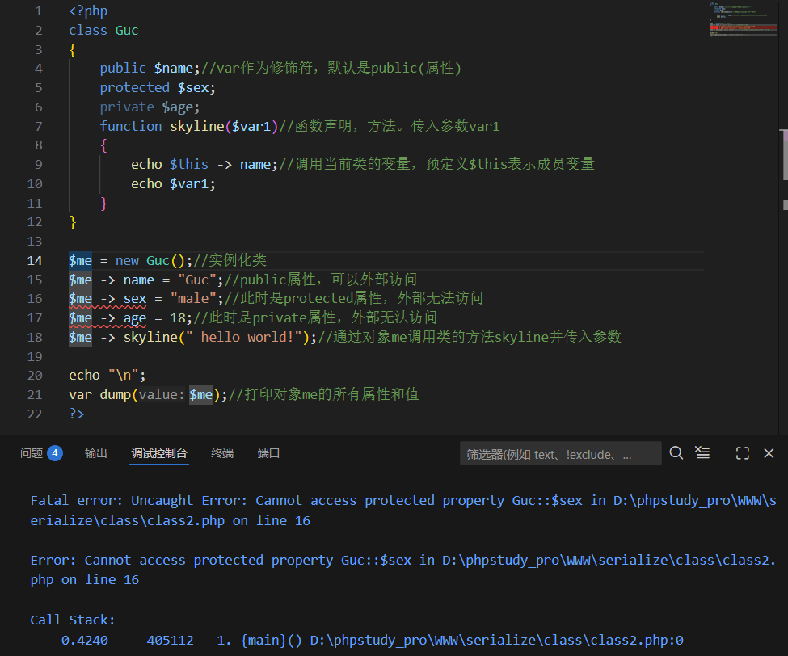

---
tags:
  - PHP
  - serialize
Date: 2026-01-03
---

```php
class skyline
{
	//成员变量声明(属性)
	//成员函数声明(方法)
}
```

例如创建一个类
```php
class Guc
{
	var $name;//var作为修饰符，默认是public(属性)
	var $sex;
	function skyline($var1)//函数声明，方法。传入参数var1
	{
		echo $this -> name;//调用当前类的变量，预定义$this表示成员变量
		echo $var1;
	}
}
```

实例化
指定成一个对象，然后才能调用类里面的函数

```php
<?php

class Guc

{

    var $name;//var作为修饰符，默认是public(属性)

    var $sex;

    function skyline($var1)//函数声明，方法。传入参数var1

    {

        echo $this -> name;//调用当前类的变量，预定义$this表示成员变量

        echo $var1;

    }

}

  

$me = new Guc();//实例化类

$me -> name = "Guc";//通过对象me调用类的属性name然后赋值

$me -> sex = "male";//通过对象me调用类的属性sex然后赋值

$me -> skyline(" hello world!");//通过对象me调用类的方法skyline并传入参数

?>
```
构建一个实例化对象然后给<mark style="background: #FFB8EBA6;">变量</mark>赋值
最后调用函数传入字符串


使用`print_r`打印实例化对象后
得到数组的表示形式
```outcome
Guc Object

(

[name] => Guc

[sex] => male

)
```
使用`var_dump`可以更直观看到类和对象的关系
```outcome
class Guc#1 (2) {

public $name =>

string(3) "Guc"

public $sex =>

string(4) "male"

}
```
成员属性都显示了出来

#### 可以看到实例化对象后，能显示的只有成员属性，并没有方法

## 类的修饰符

对成员属性的定义
常用的有<mark style="background: #FFB8EBA6;">public，protected，private</mark>
在调用类的时候分别有不同的限制

| 类         | 内部  | 子部  | 外部  |     |
| --------- | --- | --- | --- | --- |
| public    | T   | T   | T   |     |
| protected | T   | T   | F   |     |
| private   | T   | F   | F   |     |
当修改上述Guc类的成员属性含有protected和private的时候就会在调用报错



